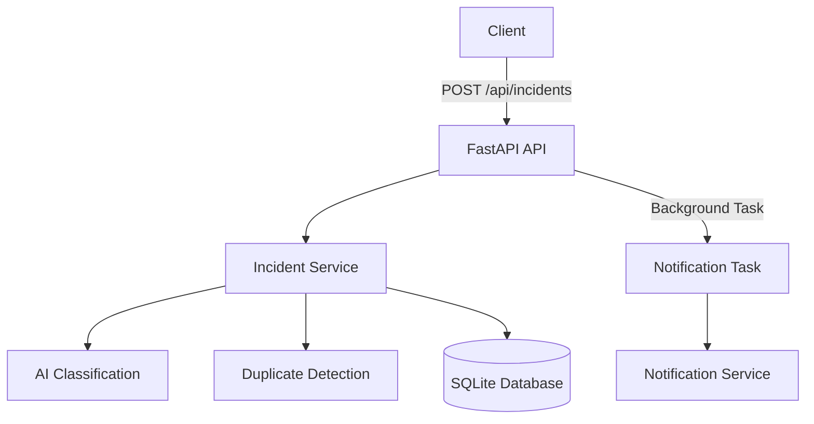

# Smart Disaster & Emergency Management Platform

An intelligent, real-time control room backend for emergency incident management and automated response.

## 1. Project Overview

The Smart Disaster & Emergency Management Platform is designed to assist emergency response control rooms by streamlining the ingestion, classification, and triage of emergency reports. The system serves emergency operators and first responders by automatically analyzing incoming incident descriptions, detecting duplicate reports in the same geographic area, and instantly notifying appropriate agencies for high-severity events.

**Incident Lifecycle:**
1. A reporter or external system submits an emergency report.
2. The AI service evaluates the description to assign a severity level.
3. The duplicate detection service checks for similar active incidents nearby.
4. The incident is securely saved to the database.
5. If the severity is High and it is a unique report, a non-blocking background task dispatches an instant notification to emergency handlers.

## 2. Key Highlights

- **Real-time-ready FastAPI backend**: Built with Python and FastAPI for high concurrency and asynchronous processing.
- **Incident ingestion and CRUD APIs**: Fully functional REST APIs for creating, listing, retrieving, and updating incidents.
- **AI severity classification**: Rule-based text analysis automatically determines High, Medium, or Low severity.
- **Spatial and text-based duplicate detection**: Uses Haversine distance and `difflib` sequence matching to find similar recent incidents.
- **Duplicate incident linking**: Automatically flags duplicates and links them to the original incident ID.
- **Automated high-severity notifications**: Instantly dispatches alerts for critical emergencies.
- **Non-blocking background notification handling**: FastAPI `BackgroundTasks` ensure the API responds instantly, even if notifications take time.
- **Automated testing**: Comprehensive pytest suite covering all business logic and edge cases.

## 3. Architecture

- **FastAPI**: Provides the high-performance ASGI web framework and automatic OpenAPI documentation.
- **Async SQLAlchemy**: The ORM used for non-blocking database interactions.
- **SQLite**: The persistent relational database used for the MVP.
- **aiosqlite**: The asynchronous SQLite driver.
- **Pydantic**: Enforces strict request and response data validation.
- **Alembic**: Manages database schema migrations.
- **AI classification service**: Analyzes incident text for critical keywords to assign severity.
- **Duplicate detection service**: Calculates geographic distance (Haversine) and text similarity to detect duplicate reports.
- **Notification service**: Dispatches alerts via console mock or Twilio SMS.
- **Background tasks**: FastAPI feature used to offload notification dispatching outside the HTTP request-response cycle.
- **Pytest**: The framework used for automated testing.
- **Uvicorn**: The ASGI server running the FastAPI application.



## 4. Phase Breakdown

### Phase 1 — Core Backend
- **Database models**: Built with SQLAlchemy DeclarativeBase and standard constraints.
- **Async SQLAlchemy**: Non-blocking database session management.
- **Alembic migrations**: Fully configured for async schema management.
- **CRUD APIs**: Endpoints to create, read, and list paginated incidents, as well as update status.
- **Validation**: Pydantic schemas validating coordinates, enums (Fire, Flood, etc.), and string lengths.
- **Incident lifecycle/status handling**: Transitions from `Pending` to `Assigned` to `Resolved`.

### Phase 2 — Intelligent Incident Processing
- **Severity classification**: Analyzes descriptions to determine `High`, `Medium`, or `Low` severity.
- **Text analysis/rules**: Uses a rule-based keyword matching system (e.g., "building collapse", "explosion" for High).
- **Geographic duplicate detection**: Queries recent unresolved incidents to find nearby reports.
- **Distance calculation**: Implements the Haversine formula to calculate the great-circle distance in meters.
- **Text similarity method**: Uses Python's built-in `difflib.SequenceMatcher` to compare descriptions.
- **Duplicate linking behavior**: Flags new incidents with `is_duplicate = True` and records the `duplicate_of_id`.

### Phase 3 — Automated Notifications
- **High-severity trigger**: Automatically queues a notification when a unique `High` severity incident is saved.
- **Notification service**: A modular service supporting multiple dispatch methods.
- **Background task behavior**: Uses FastAPI's `BackgroundTasks` so notification latency or failure never delays the 201 Created response.
- **Mock console dispatcher**: Safely logs a formatted emergency alert block to the console when real credentials are not provided.
- **Configurable recipients/settings**: Environment variables control whether notifications are enabled, which severities trigger them, and who the handlers are.
- **Failure handling**: The dispatcher catches all internal exceptions, preventing background task crashes from affecting the main application state.
- **Duplicate notification behavior**: Deliberately suppresses notifications for duplicate incidents to prevent alert fatigue.

## 5. Project Structure

```text
backend/
├── alembic/                 # Database migration scripts
├── app/
│   ├── api/                 # FastAPI routers (endpoints)
│   ├── core/                # Configuration and environment variables
│   ├── database/            # Database connection and base models
│   ├── models/              # SQLAlchemy ORM models
│   ├── schemas/             # Pydantic validation schemas
│   ├── services/            # Business logic (AI, duplicates, notifications)
│   └── main.py              # FastAPI application entry point
├── tests/                   # Pytest automated test suite
├── .env.example             # Template for environment variables
├── alembic.ini              # Alembic configuration file
├── pytest.ini               # Pytest configuration file
├── requirements.txt         # Python dependencies
└── README.md                # Project documentation
```

## 6. Technology Stack

| Technology | Purpose |
| --- | --- |
| Python | Backend development |
| FastAPI | REST API framework |
| SQLAlchemy Async | Database ORM |
| SQLite | Persistent database |
| aiosqlite | Async SQLite driver |
| Alembic | Database migrations |
| Pydantic | Request/response validation |
| Pytest | Automated testing |
| Uvicorn | ASGI server |

## 7. Local Setup

### Clone project
```powershell
git clone <repository_url>
cd backend
```

### Create virtual environment
```powershell
python -m venv .venv
```

### Activate environment
```powershell
.\.venv\Scripts\Activate.ps1
```

### Install dependencies
```powershell
pip install -r requirements.txt
```

### Environment configuration
Copy the example environment file:
```powershell
Copy-Item .env.example .env
```
Open `.env` in a text editor and adjust the settings. The default configuration uses SQLite, which requires no external database setup.

### Database migration
Apply the schema to the database:
```powershell
alembic upgrade head
```

### Start FastAPI
Run the development server:
```powershell
uvicorn app.main:app --reload
```

## 8. API Documentation

FastAPI automatically generates interactive API documentation available at:
- Swagger UI: `/docs`
- ReDoc: `/redoc`

### `POST /api/incidents` — Create incident
- **Purpose**: Submit a new emergency report. Severity is automatically classified by the AI service.
- **Required fields**: `title`, `description`, `latitude`, `longitude`, `category`
- **Example request**:
  ```json
  {
    "title": "Major fire at warehouse",
    "description": "A major fire has broken out at the downtown warehouse. People are trapped inside.",
    "latitude": 34.0522,
    "longitude": -118.2437,
    "category": "Fire",
    "reporter_info": "John Smith"
  }
  ```
- **Example response**:
  ```json
  {
    "title": "Major fire at warehouse",
    "description": "A major fire has broken out at the downtown warehouse. People are trapped inside.",
    "latitude": 34.0522,
    "longitude": -118.2437,
    "category": "Fire",
    "reporter_info": "John Smith",
    "id": 1,
    "severity": "High",
    "status": "Pending",
    "is_duplicate": false,
    "duplicate_of_id": null,
    "classification_reason": "Description contains indicators of a high severity event: 'major fire'.",
    "created_at": "2026-09-19T13:00:00Z",
    "updated_at": "2026-09-19T13:00:00Z"
  }
  ```
- **Status codes**: `201 Created` (Success), `422 Unprocessable Entity` (Validation Error)

### `GET /api/incidents` — List incidents
- **Purpose**: Retrieve a paginated list of incidents with optional filtering.
- **Query Params**: `category`, `severity`, `status`, `page`, `page_size`

### `PATCH /api/incidents/{id}/status` — Update status
- **Purpose**: Transition an incident's status.
- **Request body**: `{ "status": "Assigned" }`

## 9. Swagger Testing

You can interactively test the API through Swagger UI at `http://127.0.0.1:8000/docs`.

### Example 1 — High severity incident
1. Open `POST /api/incidents` and click **Try it out**.
2. Paste the following JSON:
   ```json
   {
     "title": "Building collapse",
     "description": "Severe building collapse downtown, people trapped under debris.",
     "latitude": 40.7128,
     "longitude": -74.0060,
     "category": "Other"
   }
   ```
3. **Execute**.
4. **Expected Result**: The API returns `201 Created`. The `severity` is automatically assigned as `"High"`. A mock notification block is immediately printed to your terminal running Uvicorn.

### Example 2 — Duplicate incident
1. Open `POST /api/incidents` again.
2. Paste a highly similar JSON located in the same geographic radius (within 500 meters by default):
   ```json
   {
     "title": "Building collapsed in downtown",
     "description": "A building collapsed downtown, many people are trapped under the rubble.",
     "latitude": 40.7129,
     "longitude": -74.0061,
     "category": "Other"
   }
   ```
3. **Execute**.
4. **Expected Result**: The API returns `201 Created`. The response shows `is_duplicate: true` and `duplicate_of_id: 1` (linking to the first incident). No terminal notification is triggered because duplicates are suppressed.

## 10. Testing

The project includes a robust automated test suite using Pytest and HTTPX.

To run the tests:
```powershell
pytest -v
```

Verified test result: `20 tests passed`.

## 11. Configuration

The application is configured via environment variables (see `.env.example`).

Key settings include:
- `DEFAULT_SEVERITY`: Fallback severity level (e.g., "Medium").
- `NOTIFICATION_ENABLED`: Set to `true` or `false` to toggle the entire notification system.
- `NOTIFY_ON_SEVERITIES`: Comma-separated list of severities that trigger alerts (e.g., `High`).
- `EMERGENCY_HANDLERS`: Comma-separated list of responder agencies included in the alert.
- `TWILIO_ACCOUNT_SID` / `TWILIO_AUTH_TOKEN`: Optional Twilio credentials. If left blank, the system gracefully falls back to the mock console dispatcher.

Duplicate detection thresholds (radius and similarity) are currently maintained within `app/services/duplicate_service.py`.

## 12. Demo Flow

1. Submit emergency report via API.
        ↓
2. FastAPI validates request payload using Pydantic.
        ↓
3. AI Classification service analyzes text and assigns severity.
        ↓
4. Duplicate detection calculates Haversine distance and text similarity against recent incidents.
        ↓
5. Incident is committed to the SQLite database.
        ↓
6. If High severity and not a duplicate, FastAPI BackgroundTask queues the alert.
        ↓
7. Notification service dispatches the alert to the terminal (or Twilio).

## 13. Limitations & Future Scope

The following features are planned for future phases but are NOT currently implemented:
- Real-time WebSocket live dashboard.
- Redis-based event distribution for horizontal scaling.
- React control-room interface.
- Advanced ML/LLM classification models (currently rule-based).
- PostgreSQL/PostGIS integration for advanced geospatial queries (currently SQLite + Haversine).
- Authentication and role-based access control (JWT/API keys).
