# ResQGrid — Intelligent Emergency Response & Resource Coordination Platform

> **BitNBuild Hackathon | Team: Just-Us League | Problem Statement: PS-9**

ResQGrid is an intelligent emergency response and resource coordination platform designed to consolidate fragmented emergency information into a single operational command view. Built for Emergency Operations Centers (EOCs), municipal authorities, and first-responder dispatchers, ResQGrid automates multi-channel data ingestion, AI-powered incident triage, intelligent deduplication, algorithmic resource matching, and real-time SLA escalation tracking.

---

## Table of Contents

- [Overview](#overview)
- [The Problem](#the-problem)
- [The ResQGrid Solution](#the-resqgrid-solution)
- [Why ResQGrid](#why-resqgrid)
- [Key Capabilities](#key-capabilities)
- [System Architecture](#system-architecture)
- [Data Ingestion Pipeline](#data-ingestion-pipeline)
- [AI & Intelligence Layer](#ai--intelligence-layer)
- [Application & Dispatcher Workflow](#application--dispatcher-workflow)
- [Technology Stack](#technology-stack)
- [Frontend & Command Center](#frontend--command-center)
- [Backend Architecture](#backend-architecture)
- [Database & Data Models](#database--data-models)
- [Real-Time Processing & Event Bus](#real-time-processing--event-bus)
- [Alerts, SLA Monitoring & Escalation](#alerts-sla-monitoring--escalation)
- [Analytics & Incident Intelligence](#analytics--incident-intelligence)
- [v2 Expansion — RBAC, Weather Intelligence & Multi-Agency Coordination](#v2-expansion--rbac-weather-intelligence--multi-agency-coordination)
- [Research & Conceptual Foundation](#research--conceptual-foundation)
- [AI-Assisted Development Workflow](#ai-assisted-development-workflow)
- [Team & Responsibilities](#team--responsibilities)
- [Testing & Validation](#testing--validation)
- [Security & System Resilience](#security--system-resilience)
- [Impact & Operational Value](#impact--operational-value)
- [Future Scope](#future-scope)
- [Repository Structure](#repository-structure)
- [Setup & Usage](#setup--usage)
- [Project Links](#project-links)
- [Documentation Index](#documentation-index)

---

## Overview

During large-scale emergencies, response personnel are overwhelmed by incoming reports across incompatible communication channels. ResQGrid provides a unified operational command center that turns chaotic data streams into clear, prioritized, actionable emergency operations.

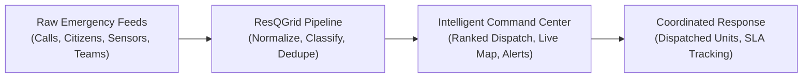

The platform operates on a **human-in-the-loop** paradigm: while AI and mathematical models rapidly process data, score resources, and calculate response times, emergency dispatchers maintain full operational authority with single-click dispatch confirmation.

---

## The Problem

**PS-9: Intelligent Emergency Response & Resource Coordination Platform**

During major emergencies—such as urban floods, industrial fires, building collapses, and highway collisions—critical information arrives from disconnected sources: emergency phone calls, citizen web reports, environmental sensors, field radio updates, hospital bed reports, and municipal department feeds.

This fragmentation creates three critical operational bottlenecks:
1. **Information Overload and Noise**: A single visible incident often generates dozens of redundant reports across different channels, burying novel crises beneath duplicate information.
2. **Delayed Situational Awareness**: Manual triage across disparate systems prevents dispatchers from quickly understanding the actual geographic footprint, severity, and progression of an emergency.
3. **Suboptimal Resource Allocation**: Dispatchers under high stress must manually estimate travel times, unit capabilities, and availability, leading to resource misallocation and response delays.

ResQGrid directly addresses these challenges by uniting these fragmented channels into an automated, intelligent, real-time command platform.

---

## The ResQGrid Solution

ResQGrid structures emergency management into an automated, continuous operational pipeline:

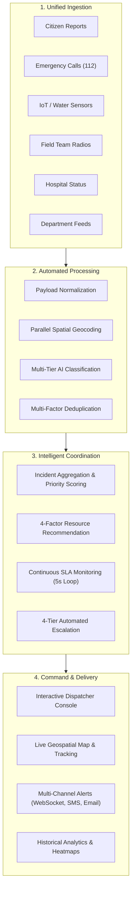

The system ingests raw messages, validates them against standardized schemas, resolves locations to geographical coordinates, classifies incident types and priority tiers, merges duplicate reports into unified incidents, scores and ranks available first-responder units, and monitors response milestones against strict Service Level Agreements (SLAs).

---

## Why ResQGrid

- **Unified Multi-Source Ingestion**: Ingests structured and unstructured reports across 6 distinct channels via standardized REST endpoints.
- **Intelligent Noise Reduction**: Employs spatial, textual, categorical, and temporal similarity algorithms to merge duplicate reports into single incidents, preventing dispatcher fatigue.
- **Zero-Key Operational Guarantee**: High-availability AI architecture falls back seamlessly from cloud LLMs to local machine learning models and deterministic keyword rule engines, guaranteeing 100% uptime without external API dependencies.
- **Objective Resource Scoring**: Replaces manual guesswork with an algorithmic scoring engine considering proximity, capability compatibility, readiness, and active workload.
- **Proactive SLA Governance**: Continuously evaluates response time thresholds and automatically escalates neglected incidents across a 4-tier chain of command.
- **Full Auditability**: Logs every automated classification, merge decision, and status modification into an immutable audit trail for post-incident review.

---

## Key Capabilities

### Incident Ingestion & Processing
- **6 Ingest Channels**: Dedicated endpoints for citizen submissions, 112 emergency calls, IoT environmental sensors, field team reports, hospital bed updates, and inter-departmental notices.
- **Vadodara Spatial Gazetteer**: Built-in spatial gazetteer resolving local landmarks, industrial zones (e.g., Makarpura GIDC), rivers (Vishwamitri), and transit corridors (NH48) into GPS coordinates.
- **Parallel Pipeline Execution**: Concurrent execution of geocoding and AI classification using Python `asyncio` for sub-second ingestion latency.

### AI-Powered Triage & Classification
- **8 Incident Classifications**: Automatically categorizes events into Fire, Flood, Road Accident, Medical, Industrial Hazard, Building Collapse, Gas Leak, and Other.
- **4 Priority Tiers**: Assigns P1 (Critical - Life Threatening), P2 (High - Serious Risk), P3 (Medium - Property/Infrastructure), or P4 (Low - Advisory) based on casualty counts, trapped individuals, and hazardous materials.
- **4-Tier Fallback Chain**: Primary LLM (Groq Llama-3.3-70B) $\rightarrow$ Secondary LLM (Google Gemini 2.0 Flash) $\rightarrow$ Offline ML (scikit-learn LogisticRegression + TF-IDF) $\rightarrow$ Deterministic Keyword Rules.
- **Circuit Breaker Protection**: Automatically isolates failing LLM endpoints after 3 consecutive errors and routes requests through local ML models during network disruptions.

### Multi-Factor Deduplication
- **Weighted Similarity Engine**: Computes similarity using 40% geographic distance (Haversine formula), 35% textual similarity (TF-IDF vector cosine), 15% incident category match, and 10% temporal proximity.
- **Race Condition Prevention**: Synchronized execution using `asyncio.Lock` ensures concurrent reports for the same incident are merged cleanly without duplicate database records.
- **Configurable Action Thresholds**: Merges reports with similarity $\ge 0.75$ directly into the active incident; marks reports between $0.50$ and $0.74$ as related incidents for dispatcher verification.

### Algorithmic Resource Coordination
- **4-Factor Unit Scoring**: Evaluates candidate first-responder units using:
  - **45% Proximity**: Calculated via Haversine distance to incident coordinates.
  - **25% Capability Match**: Verified against incident requirements (e.g., HazMat equipment for chemical fires, Rescue Boats for floods, Advanced Life Support for severe trauma).
  - **15% Readiness**: Status evaluation prioritizing idle and station-based units.
  - **15% Workload Balance**: Penalizes units currently handling active tasks to prevent responder burnout.
- **1-Click Dispatch Workflow**: Displays ranked unit recommendations with estimated response times (ETAs); dispatchers can approve recommendations instantly or modify unit selections.

### Real-Time Monitoring & SLA Escalation
- **5-Second SLA Loop**: Background asynchronous task continuously monitors active incidents against 8 operational alert rules (R0 through R7).
- **4-Tier Escalation Ladder**: Automatically escalates unaddressed critical incidents from Dispatchers (Level 0) to Shift Supervisors (Level 1), District EOC Leads (Level 2), and State Authorities (Level 3).
- **Multi-Channel Notification Dispatch**: Broadcasts alerts in real time over WebSockets to the web console, with automated SMS (Twilio) and Email (SMTP) dispatches to supervisory personnel.

### Live Command Console & Analytics
- **Interactive Geospatial Map**: React-Leaflet interface rendering active incident markers, response unit locations, sensor telemetry, and hospital capacity status.
- **Live Unit Tracking**: Simulated unit movement showing dispatched vehicles traveling toward incident coordinates in real time.
- **Incident Intelligence & Heatmaps**: Historical analytics interface rendering incident density heatmaps, category distribution charts, response time trends, and resource utilization metrics.
- **Scenario Simulator**: Built-in demonstration engine supporting scripted simulations (e.g., Vishwamitri river flood, GIDC chemical fire, NH48 multi-vehicle collision) with adjustable time scaling.

### Role-Based Access Control & Multi-Portal Access
- **Login & Role Routing**: A dedicated `/login` portal authenticates users into one of three operational roles — **Dispatcher**, **Field Team**, and **Hospital** — each redirected to its own authorized workspace via a `RoleGuard` route wrapper.
- **Server-Side RBAC Enforcement**: The backend mirrors this on every sensitive endpoint via an `X-Role` header dependency (`core/roles.py`), rejecting unauthorized requests with `403 Forbidden` regardless of what the frontend allows.
- **Graceful Access Redirection**: Attempting to reach an unauthorized workspace redirects the user to their own portal with a toast notification, rather than a hard error.

### Live Weather Intelligence
- **Open-Meteo Integration (Zero-Key)**: A `WeatherWidget` component pulls current conditions and a 24-hour forecast for Vadodara (temperature, humidity, wind speed, precipitation) from the free Open-Meteo API — no API key required.
- **Automated Risk Hinting**: Weather codes are translated into a `none / low / moderate / high` risk hint (e.g., thunderstorm codes flag "high" risk) to give dispatchers early warning of weather-driven incident surges such as flash flooding.

---

## System Architecture

ResQGrid is built on a clean, decoupled architecture separating ingestion, core processing, background task management, persistence, and real-time client presentation:

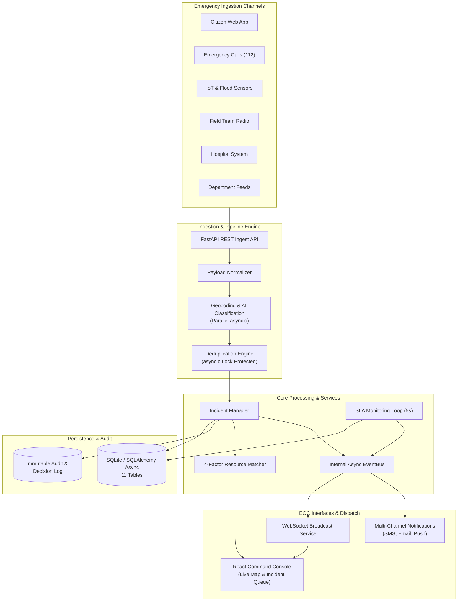

---

## Data Ingestion Pipeline

The ingestion pipeline processes every emergency report through a rigorous 5-stage workflow designed for low latency, data integrity, and deterministic deduplication:

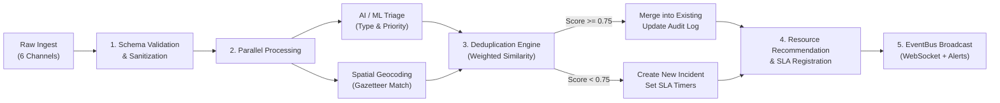

### Pipeline Stages

1. **Validation & Normalization**: The payload is validated against strict Pydantic models. Missing attributes are assigned safe defaults, and text fields are sanitized.
2. **Parallel Geocoding & Classification**:
   - Geocoding resolves textual location descriptions (e.g., "Alkapuri near railway station") into latitude and longitude coordinates using the Vadodara spatial gazetteer.
   - Classification extracts the incident type, severity indicators (casualties, trapped individuals, hazardous material presence), and priority level using the AI triage engine.
3. **Deduplication Engine**:
   - Acquires an asynchronous mutex (`asyncio.Lock`) to prevent race conditions during concurrent report bursts.
   - Queries open incidents within the temporal and geographic window.
   - Computes composite similarity scores across geographic, textual, categorical, and temporal dimensions.
   - If similarity $\ge 0.75$, the report is merged into the existing incident, updating casualty counts and report tallies.
   - If similarity $< 0.75$, a new incident record is instantiated.
4. **Resource Recommendation & SLA Registration**:
   - For new or escalated incidents, the resource matching engine evaluates candidate units and attaches top-ranked recommendations.
   - SLA monitoring thresholds are registered in the background scheduler.
5. **Real-Time Notification & Event Broadcast**:
   - The updated incident state is committed to the database.
   - An event is published to the internal `EventBus`, broadcasting updates across active WebSocket connections to all connected dispatcher consoles in $< 100\text{ ms}$.

---

## AI & Intelligence Layer

ResQGrid utilizes a resilient, multi-tiered AI architecture that balances modern large language models with offline, deterministic fallback systems.

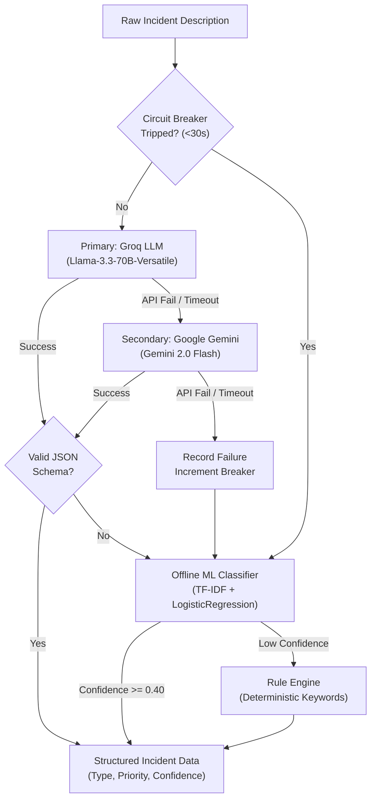

### 1. Primary & Secondary LLM Triage
- **Groq API (Llama-3.3-70B-Versatile)**: Serves as the primary intelligence engine, extracting structured incident data, estimating casualty figures, identifying hazard flags, and generating concise situation briefs in $< 500\text{ ms}$.
- **Google Gemini 2.0 Flash**: Acts as the secondary cloud fallback, invoked automatically if Groq encounters rate limits, connection timeouts, or service interruptions.

### 2. Offline Machine Learning Classifier
- **scikit-learn LogisticRegression + TF-IDF Vectorizer**: Pre-trained on emergency descriptions across all 8 incident categories. Operates completely offline with sub-millisecond execution time, ensuring operational continuity even during total internet isolation.

### 3. Deterministic Keyword Rule Engine
- **Regex & Keyword Pattern Matching**: Provides a fail-safe baseline, scanning for critical emergency keywords (e.g., "fire", "smoke", "flood", "cylinder", "bleeding", "trapped") to guarantee that no report fails classification.

### 4. Advisory-Only AI Architecture
- AI models provide recommendations and automated triage proposals. **No AI model autonomously dispatches resources or closes incidents.** Every operational dispatch decision requires confirmation by a human dispatcher in the command center.

---

## Application & Dispatcher Workflow

The dispatcher workflow is designed for high-stress operational environments, minimizing required clicks while providing maximum contextual awareness:

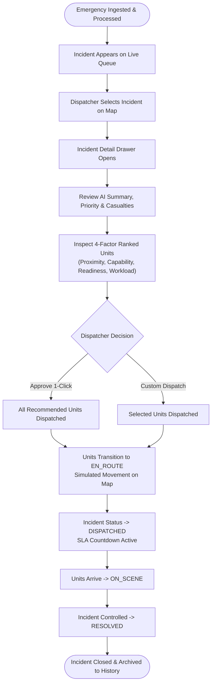

---

## Technology Stack

The platform is built using modern, production-grade open-source technologies:

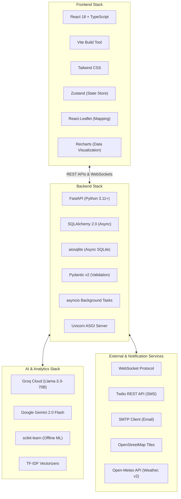

### Detailed Component Matrix

| Layer | Technology | Purpose |
|---|---|---|
| **Frontend Framework** | React 18 (TypeScript) | Declarative UI components with strict static type safety |
| **Frontend Tooling** | Vite | Ultra-fast HMR and optimized production bundling |
| **Styling** | Tailwind CSS | Consistent, utility-first design system with high visual hierarchy |
| **State Management** | Zustand | Lightweight, reactive centralized stores for incidents, units, and alerts |
| **Geospatial Mapping** | React-Leaflet / Leaflet | Interactive mapping rendering emergency markers, radius circles, and unit movement |
| **Data Visualization** | Recharts | Composable charting library for incident analytics, trends, and SLA metrics |
| **Backend Framework** | FastAPI (Python 3.11+) | Asynchronous, high-performance REST API and WebSocket server |
| **Database ORM** | SQLAlchemy 2.0 (Async) | Async relational database abstraction with strict relationship models |
| **Database Engine** | SQLite via `aiosqlite` | Zero-configuration asynchronous relational persistence for development and testing |
| **Data Validation** | Pydantic v2 | High-throughput schema validation and serialization |
| **Primary Cloud LLM** | Groq (Llama-3.3-70B-Versatile) | High-speed incident classification, priority scoring, and narrative generation |
| **Secondary Cloud LLM** | Google Gemini 2.0 Flash | Cloud fallback for incident triage and extraction |
| **Offline Machine Learning**| scikit-learn | Offline TF-IDF vectorization and Logistic Regression classification |
| **Real-Time Communication**| WebSockets (`/ws`) | Bidirectional, low-latency state synchronization between backend and frontend |
| **External Messaging** | Twilio API & SMTP | Automated emergency SMS alerts and supervisor email escalation dispatches |
| **Weather Intelligence (v2)** | Open-Meteo API | Zero-key current conditions and 24h forecast with automated risk hinting |
| **Access Control (v2)** | Custom RBAC (`X-Role` header) | Role-based endpoint protection for Dispatcher, Field Team, and Hospital roles |
| **Page Transitions** | Framer Motion | Animated route transitions across the multi-role frontend (Console, Login, Ops, etc.) |
| **Client-Side Routing** | React Router DOM | Role-guarded route definitions across all frontend workspaces |

---

## Frontend & Command Center

The ResQGrid frontend delivers a modern command console built for speed, clarity, and continuous situational awareness.

*Frontend Architecture & UI/UX led by **Tirth Bariya**.*

```
┌───────────────────────────────────────────────────────────────────────────────┐
│ ResQGrid EOC Console     [Active: 8]  [P1 Critical: 2]  [Units Available: 31] │
├────────────────────────────────┬──────────────────────────────────────────────┤
│ 📋 Incident Queue              │ 🗺️ Geospatial Command Map                    │
│ ────────────────────────────── │ ──────────────────────────────────────────── │
│ [P1] 🔥 Chemical Fire (GIDC)   │   (Interactive Vadodara OpenStreetMap)       │
│      Reports: 14 | ETA: 4m     │                                              │
│      Units: 3 Dispatched       │    🔥 P1 Incident (Makarpura)                │
│                                │    💧 P2 Flood Marker (Vishwamitri)          │
│ [P1] 🌊 River Breach           │    🚒 Fire Unit (EN_ROUTE -> Moving)         │
│      Reports: 9 | ETA: 6m      │    🚑 Ambulance (AVAILABLE)                 │
│      Units: 2 Dispatched       │    🏥 Hospital Marker (SSG: 12 Beds)         │
│                                │                                              │
│ [P2] 🚗 NH48 Multi-Collision   │                                              │
│      Reports: 5 | ETA: 8m      │                                              │
├────────────────────────────────┴──────────────────────────────────────────────┤
│ ⚡ Slide-out Incident Drawer: AI Summary, 4-Factor Ranked Units, 1-Click Dispatch│
└───────────────────────────────────────────────────────────────────────────────┘
```

### Key Frontend Views

1. **Dispatcher Console (`/`)**:
   - **Split-View Interface**: Real-time incident list on the left with priority indicators, report counters, and SLA countdowns; interactive full-screen map on the right.
   - **Geospatial Map**: Displays custom color-coded markers for incident priorities (Red: P1, Orange: P2, Yellow: P3, Blue: P4), active response units, environmental sensors, and hospitals.
   - **Slide-out Incident Drawer**: Provides detailed incident breakdowns, AI-generated situation summaries, casualty counts, and the 4-factor ranked unit recommendation list with 1-click dispatch.
2. **Analytics Dashboard (`/analytics`)**:
   - Renders incident volume heatmaps across Vadodara's administrative zones.
   - Visualizes incident distribution by category, hourly frequency trends, and average response times.
   - Displays resource utilization ratios and hospital bed occupancy graphs.
3. **Citizen Reporting Portal (`/report`)**:
   - Mobile-responsive citizen submission form supporting text descriptions, photo attachments, category selection, and GPS geolocation capture.
4. **Public Incident Tracker (`/track`)**:
   - Transparent status-tracking interface enabling citizens to monitor the verification and dispatch progress of submitted reports using an incident tracking ID.
5. **Hospital Capacity View (`/hospital`)**:
   - Real-time dashboard showing emergency department bed availability, ICU capacity, and blood bank reserves across major medical centers.
6. **Incident Scenario Simulator (`/simulator`)**:
   - Interactive control panel allowing evaluators to inject realistic emergency scenarios (Floods, Chemical Fires, Highway Collisions) with adjustable time scaling (1x to 10x speed).
7. **Login & Role Portal (`/login`)**:
   - Role-selection entry point authenticating users as Dispatcher, Field Team, or Hospital staff and routing each into their authorized workspace.
8. **Broadcast Center (`/broadcast`)**:
   - Dispatcher tool for issuing public-safety broadcast alerts with severity levels (info/warning/critical), area targeting, expiry timers, and multi-language (Hindi/Gujarati) message bodies.
9. **Mutual Aid Requests (`/mutual-aid`)**:
   - Cross-agency coordination view for requesting, tracking, and approving/declining external resource assistance (e.g., NDRF, neighboring municipality units) tied to a specific incident.
10. **Ops Center (`/ops`)**:
    - Consolidated operations view surfacing the full audit trail, shift handover notes, and post-incident review submissions for accountability and continuity between shifts.

---

## Backend Architecture

The backend is structured around modular, loosely-coupled services operating on FastAPI's asynchronous architecture:

```
backend/app/
├── api/                  # REST and WebSocket route controllers
│   ├── ingest.py         # 6 ingest endpoints for multi-channel data
│   ├── incidents.py      # Incident querying, updating, and drawer details
│   ├── units.py          # Response unit tracking, status, and dispatch
│   ├── alerts.py         # SLA alert queries, acknowledgements, escalations
│   ├── analytics.py      # Aggregated metrics, heatmaps, and trend data
│   ├── hospitals.py      # Hospital capacity and bed availability endpoints
│   ├── simulator.py      # Scripted scenario injection and time scale controls
│   ├── broadcast.py      # v2: Public-safety broadcast alerts (multi-language)
│   ├── mutual_aid.py     # v2: Cross-agency mutual aid request workflow
│   ├── ops.py            # v2: Audit trail, shift handover, post-incident review
│   ├── v2.py             # v2: Weather feed, incident replay, cascading-risk,
│   │                     #     report verification, evacuation routing, reallocation
│   └── websocket.py      # WebSocket connection manager and broadcast loop
├── core/                 # Core engine components
│   ├── config.py         # Environment variables and settings
│   ├── event_bus.py      # Internal asynchronous pub/sub event bus
│   ├── llm_client.py     # Groq, Gemini, and circuit breaker implementation
│   ├── roles.py          # v2: RBAC dependency (X-Role header enforcement)
│   └── gazetteer.py      # Vadodara spatial gazetteer and geocoding index
├── db/                   # Database models and session management
│   ├── models.py         # 11 SQLAlchemy relational models
│   ├── session.py        # Async session factory and engine configuration
│   └── seed.py           # Database seeder (44 units, 14 hospitals, 25 sensors)
├── services/             # Core business logic engines
│   ├── pipeline.py       # 5-stage ingestion pipeline with deduplication lock
│   ├── classify.py       # Multi-tier AI/ML classification service
│   ├── dedupe.py         # Multi-factor similarity scoring engine
│   ├── recommend.py      # 4-factor resource scoring and matching algorithm
│   ├── sla.py            # 5-second SLA monitoring loop and alert evaluator
│   └── notifier.py       # Multi-channel notification dispatcher (WS/SMS/Email)
└── data/                 # Training sentences, gazetteer points, and seed records
```

---

## Database & Data Models

The persistence layer is implemented with SQLAlchemy 2.0 async models over an asynchronous relational database, comprising 11 interconnected entities (plus two v2 additions — `Broadcast` and `MutualAid` — described in [v2 Expansion](#v2-expansion--rbac-weather-intelligence--multi-agency-coordination), bringing the current total to 12 tables):

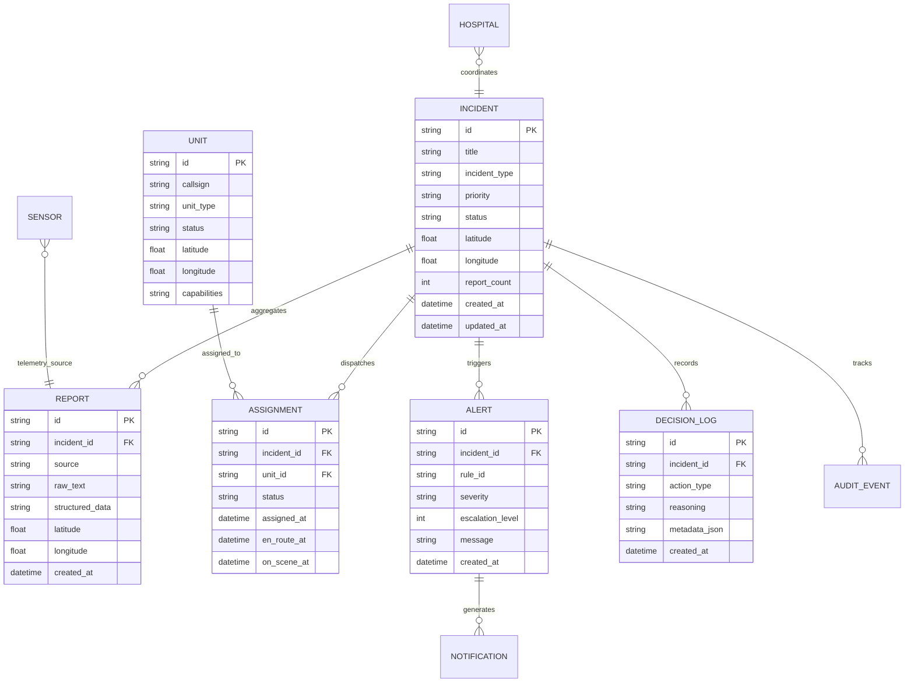

### Core Data Entities

- **`Incident`**: Represents a consolidated emergency event with unified coordinates, priority tier, status (`NEW`, `TRIAGED`, `DISPATCHED`, `ON_SCENE`, `CONTAINED`, `RESOLVED`, `CLOSED`), and aggregated casualty counts.
- **`Report`**: Stores raw incoming messages from any of the 6 ingest channels, linked to their parent `Incident` upon deduplication.
- **`Unit`**: Represents emergency response assets (Fire Engines, HazMat Vans, Ambulances, Rescue Boats, Police Patrols) with live GPS coordinates, operational status, and capability tags.
- **`Assignment`**: Tracks the lifecycle of a unit assigned to an incident, logging timestamps for dispatch, en-route transit, on-scene arrival, and release.
- **`Alert`**: Records SLA threshold violations, rule triggers, and current escalation levels.
- **`DecisionLog`**: Captures every automated decision (classification confidence, deduplication score breakdown, resource recommendation rank) for full algorithmic transparency.
- **`AuditEvent`**: An immutable chronological audit log tracking every user action, status change, and dispatch confirmation for post-incident reviews.

---

## Real-Time Processing & Event Bus

ResQGrid features an asynchronous, event-driven internal messaging architecture:

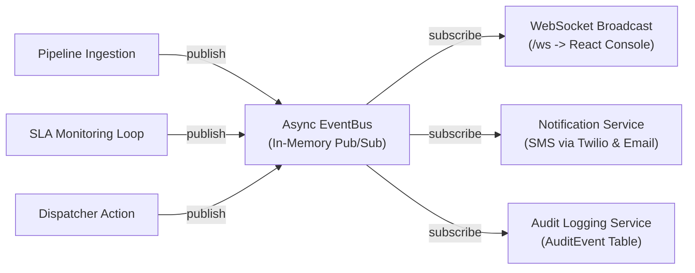

- **WebSocket Synchronization (`/ws`)**: Connected clients receive instant event notifications for `INCIDENT_CREATED`, `INCIDENT_UPDATED`, `UNIT_STATUS_CHANGED`, `UNIT_LOCATION_UPDATED`, and `ALERT_TRIGGERED`.
- **Automatic Reconnection**: The frontend client implements an exponential backoff reconnection strategy ($1\text{s} \rightarrow 2\text{s} \rightarrow 4\text{s} \rightarrow \dots \rightarrow 30\text{s}$ max) to maintain continuous connection integrity under unstable network conditions.
- **Simulated Real-Time Unit Mover**: A background asynchronous worker updates the latitude and longitude coordinates of en-route units every 2 seconds, interpolating their path toward assigned incidents to give dispatchers realistic visual feedback.

---

## Alerts, SLA Monitoring & Escalation

To ensure critical incidents receive immediate attention, ResQGrid enforces an automated SLA governance framework.

### The 8 Alert Rules (R0 – R7)

| Rule ID | Name | Trigger Condition | Severity |
|---|---|---|---|
| **R0** | P1 Unacknowledged | P1 incident has no dispatcher acknowledgement within 2 minutes | Critical |
| **R1** | P1 No Dispatched Units | P1 incident has no assigned response units within 5 minutes | Critical |
| **R2** | P2 Unacknowledged | P2 incident has no dispatcher acknowledgement within 5 minutes | High |
| **R3** | Mass Casualty Without Medical | Incident with $\ge 5$ casualties lacks ambulance or medical assignment for $> 3$ minutes | Critical |
| **R4** | Unit Overdue / Delayed ETA | Dispatched unit travel time exceeds estimated ETA by $> 10$ minutes | Medium |
| **R5** | Critical Resource Shortage | Required capability (e.g., HazMat, Boat) unavailable in active fleet | High |
| **R6** | Incident Duration Exceeded | Incident active duration exceeds expected containment SLA window | Medium |
| **R7** | Multi-Zone Spread / Escalation | Incident escalates in severity or spreads across multiple administrative zones | High |

### 4-Tier Escalation Ladder

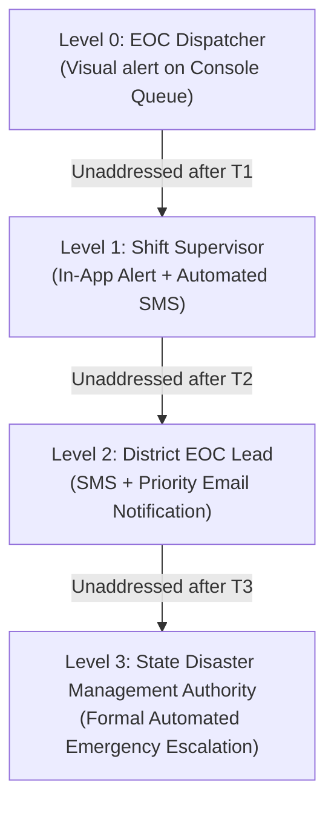

---

## Analytics & Incident Intelligence

The Analytics module converts historical and real-time operational data into strategic emergency intelligence:

- **Incident Density Heatmaps**: Geospatial kernel density visualization highlighting incident concentration across Vadodara's urban, industrial, and riverbank zones.
- **Categorical Breakdown**: Visual distribution of emergency types across selected temporal windows (Past 24 Hours, Past 7 Days, Past 30 Days).
- **Response Time Trends**: Historical tracking of average response times from initial report ingestion to on-scene arrival, broken down by priority tier.
- **Hospital Bed Occupancy**: Real-time tracking of general, ICU, and trauma bed availability across regional medical centers to prevent emergency department saturation.
- **Resource Utilization Ratios**: Visual metrics indicating fleet deployment percentages, pinpointing equipment bottlenecks (e.g., HazMat or Rescue Boat deficits).

---

## v2 Expansion — RBAC, Weather Intelligence & Multi-Agency Coordination

Following the initial build, the platform was extended with a second wave of operational modules — collectively referred to internally as **"v2"** — that add role security, environmental awareness, and cross-agency coordination on top of the core PS-9 pipeline. All v2 routes are auto-discovered and mounted under `/api` alongside the original endpoints, and every module is fully additive: no existing endpoint, model, or page was altered.

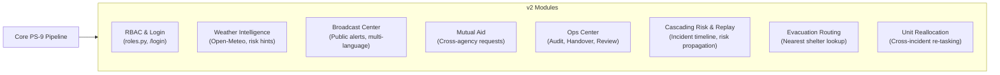

### Role-Based Access Control (`core/roles.py`)
- **`require_roles()` Dependency**: A reusable FastAPI dependency reads the `X-Role` request header (defaulting to the configured `DEFAULT_ROLE` if absent) and enforces access at the endpoint level.
- **Three Operational Roles**: `dispatcher`, `team`, and `hospital`, plus an `admin` role that bypasses all checks — mirrored on the frontend by the `RoleGuard` component and a new `/login` portal.
- **Fail-Closed Design**: Any request from a role not present in an endpoint's allow-list is rejected with `403 Forbidden` and a descriptive error, protecting the new Broadcast, Mutual Aid, and Ops endpoints (all gated to `dispatcher` by default) even if the frontend is bypassed.

### Live Weather Intelligence (`GET /api/weather`)
- Fetches current conditions and a 24-hour forecast from **Open-Meteo** (free, zero-key), covering temperature, humidity, wind speed, and precipitation for any lat/lng (defaults to Vadodara).
- Converts WMO weather codes into a simplified `none / low / moderate / high` risk hint so the dispatcher console can flag rising flood/storm risk before reports start arriving.

### Public-Safety Broadcast Center (`/api/broadcasts`)
- Dispatchers can publish area-targeted public alerts with a **severity tier** (`info` / `warning` / `critical`), an optional **expiry window**, and **multi-language bodies** (`body_hi`, `body_gu`) for Hindi and Gujarati audiences alongside the English text.
- Broadcasts can be deactivated on demand (`PATCH /broadcasts/{id}/deactivate`) once the underlying situation is resolved.

### Mutual Aid Requests (`/api/mutual-aid`)
- Formalizes requesting external assistance (e.g., NDRF, a neighboring municipality's units) against a specific incident: agency, resource type, quantity, and requester are captured on creation.
- Requests move through a decision workflow (`PATCH /mutual-aid/{id}/decide`) to `approved`, `declined`, or `arrived`, with the deciding dispatcher and any notes recorded for the audit trail.

### Ops Center — Audit, Handover & Post-Incident Review (`/api` — `ops.py`)
- **`GET /audit`**: Paginated, filterable view (by entity, entity ID, or action) over the existing immutable `AuditEvent` log, exposed as a first-class Ops Center feature rather than a raw table dump.
- **`POST /handover`**: Structured shift-handover notes so an incoming dispatcher can pick up situational context instantly at shift change.
- **`POST /incidents/{id}/review`**: Post-incident review submissions capturing what went well, what didn't, and follow-up actions once an incident is closed.

### Additional Coordination Endpoints (`v2.py`)
- **Incident Replay (`GET /incidents/{id}/replay`)**: Reconstructs the full chronological timeline of an incident — reports, classification changes, assignments, and alerts — for after-action review and training.
- **Cascading Risk Analysis (`POST /incidents/{id}/cascade`)**: Evaluates whether an active incident poses secondary risk to nearby infrastructure or populations (e.g., a gas leak threatening an adjacent facility), surfacing a proactive risk assessment before it materializes.
- **Report Verification (`POST /reports/{id}/verify`)**: Lets a dispatcher mark an individual citizen/field report as verified, strengthening the confidence signal used elsewhere in the pipeline.
- **Nearest Shelters / Evacuation Routing (`GET /evacuation/shelters`)**: Haversine-based lookup of the closest shelter facilities to a given coordinate, supporting evacuation planning during floods and large-scale incidents.
- **Unit Reallocation (`POST /reallocate`)**: Allows a dispatcher to re-task a unit from one active incident to a higher-priority one mid-response, with the change captured in the audit log.

---

## Research & Conceptual Foundation

*Research, Problem Ideation, and Project Orchestration led by **Yash Jadhav**.*

ResQGrid's technical and operational design is grounded in an extensive analysis of modern emergency management literature, disaster response protocols, and municipal command center case studies:

- **Information Fragmentation in Disasters**: Analysis of multi-agency disaster responses (such as urban monsoon flooding and industrial chemical incidents) revealed that emergency personnel spend up to 40% of their initial response window manually cross-referencing incompatible reporting channels.
- **The Deduplication Challenge**: In high-density urban areas, a single visible emergency generates an exponential burst of phone calls and social reports. Without automated deduplication, dispatchers experience severe cognitive overload, resulting in delayed responses to less visible, isolated life-threatening incidents.
- **Vadodara Urban Context**: The system was tailored to the geographical and risk profile of Vadodara, Gujarat—incorporating the annual flood patterns of the Vishwamitri River, chemical hazard zones in Makarpura GIDC, and high-frequency transit collisions along the National Highway 48 corridor.
- **Human-Centered AI Design**: Research into first-responder psychology emphasized that autonomous AI dispatching creates operational distrust. ResQGrid was deliberately engineered as an **intelligent advisory platform**, providing algorithmic recommendations, confidence scores, and reasoning explanations while leaving final authority in human hands.

---

## AI-Assisted Development Workflow

ResQGrid was developed using an integrated, multi-model AI-assisted engineering workflow. Each AI tool was selected for its distinct strengths across the software development lifecycle:

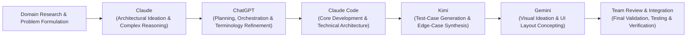

### Tool-Specific AI Contributions

- **Claude**: Utilized for high-level architectural ideation, complex problem solving, designing the multi-factor deduplication scoring formula, and formulating the 4-tier SLA escalation logic.
- **ChatGPT**: Leveraged for project orchestration, task breakdown, sprint planning, terminology standardization across emergency management domains, and drafting technical documentation structures.
- **Kimi**: Applied to automated test-case generation, synthesizing edge cases for concurrent report deduplication, malformed payload handling, and gazetteer boundary conditions.
- **Gemini**: Used for visual ideation, layout concepting for the dispatcher console, and color-palette selection for geospatial priority differentiation.
- **Claude Code / Coding Assistants**: Utilized as a technical pair-programmer for complex asynchronous Python implementations, SQLAlchemy 2.0 async migration patterns, and WebSocket broadcast stability.

*The Just-Us League team maintained full control, review, and responsibility for all architectural decisions, code integrations, manual testing, and final system validation.*

---

## Team & Responsibilities

The ResQGrid platform was designed, developed, and validated by **Team Just-Us League**:

```
┌───────────────────────────────────────────────────────────────────────────────┐
│                             JUST-US LEAGUE                                    │
├───────────────────────┬───────────────────────┬───────────────────────────────┤
│ Jaivin Vachhani       │ Ananya Yadav          │ Tirth Bariya                  │
│ Team Leader           │ Database & Structure  │ Frontend & UI/UX              │
│                       │                       │                               │
│ • AI Architecture     │ • Database Schemas    │ • React Console UI            │
│ • Ingestion Pipeline  │ • Structural Maint.   │ • Interactive Leaflet Maps    │
│ • Core System Logic   │ • Boilerplate & Setup │ • UI/UX Design System         │
│ • Resource Matching   │ • Bug Fixes & Patches │ • Responsive Views            │
├───────────────────────┴───────────────────────┴───────────────────────────────┤
│ Yash Jadhav                                                                   │
│ Research, Concept & Orchestration                                             │
│                                                                               │
│ • Problem Research & Domain Validation        • Demo Strategy & Scripts       │
│ • Ideation & Conceptual Framework             • Presentation Materials        │
│ • Documentation Architecture                  • Project Orchestration         │
└───────────────────────────────────────────────────────────────────────────────┘
```

---

## Testing & Validation

ResQGrid includes an automated test suite verifying core system logic, algorithmic calculations, and resilience patterns:

```bash
cd backend
pytest tests/ -v
```

### Test Coverage Highlights

- **Classification Testing (`test_classify.py`)**: Validates accurate categorization across all 8 emergency types, correct priority assignment (P1 through P4), and fallback transitions from LLM to ML and keyword rules.
- **Deduplication Testing (`test_dedupe.py`)**: Tests spatial distance calculations, TF-IDF cosine similarity, temporal decay factors, and boundary conditions around the 0.75 merge threshold.
- **Pipeline Integration Testing (`test_pipeline.py`)**: Exercises end-to-end ingestion across all 6 channels, verifying payload normalization, asynchronous geocoding, and race-condition prevention under simulated concurrent load.
- **Resource Recommendation Testing (`test_recommend.py`)**: Validates the 4-factor scoring algorithm, ensuring that specialized units (HazMat, Rescue Boats) are correctly prioritized for compatible emergencies.
- **SLA Alert Rule Testing (`test_sla.py`)**: Simulates response delays and verifies that rules R0 through R7 trigger appropriate alert events and escalation ladder increments.
- **Zero-Key Offline Verification**: All unit and integration tests run entirely offline without requiring external API keys or cloud access.

---

## Security & System Resilience

### Security Architecture
- **Strict Input Validation**: All incoming requests are validated against Pydantic schemas, blocking SQL injection, script injection, and malformed payloads at the API boundary.
- **Safe Secrets Management**: Cloud API keys (Groq, Gemini, Twilio) are managed exclusively through environment variables and never exposed to the client application.
- **CORS Policies**: Explicit Cross-Origin Resource Sharing configurations restrict API access to authorized frontend origins.
- **Audit Logging**: All dispatcher actions, unit status transitions, and manual overrides are recorded in the `AuditEvent` log with timestamps and user identifiers.

### Fault Tolerance & Resilience Patterns
- **Multi-Tier AI Fallback**: Quadruple-redundancy architecture (Groq $\rightarrow$ Gemini $\rightarrow$ scikit-learn $\rightarrow$ Keyword Rules) guarantees uninterrupted incident triage.
- **Circuit Breaker Pattern**: Automatically isolates failing cloud LLM endpoints after 3 consecutive errors, enforcing a 30-second cooldown period before attempting recovery.
- **Zero-Key Mode**: The platform functions with 100% operational capability in offline mode using pre-trained local ML models and the Vadodara spatial gazetteer.
- **Concurrency Locks**: `asyncio.Lock` protects deduplication evaluation against race conditions during high-volume report bursts.
- **WebSocket Reconnection Resilience**: Exponential backoff prevents client reconnection storms during server restarts.

---

## Impact & Operational Value

ResQGrid transforms emergency operations from reactive chaos into structured, proactive crisis coordination:

- **Accelerated Situational Awareness**: Replaces manual multi-channel monitoring with a unified, real-time operational map, cutting situational assessment times.
- **Elimination of Duplicate Fatigue**: Merges dozens of redundant citizen calls and sensor triggers into singular, consolidated incidents with accurate aggregate casualty and hazard metrics.
- **Optimized Resource Deployment**: Algorithmic unit matching ensures that the closest, most capable, and most available first-responder units are recommended immediately.
- **Accountability via Automated SLAs**: Proactive escalation rules prevent forgotten or neglected incidents from slipping through the cracks during major crisis events.
- **Complete Post-Disaster Auditability**: Immutable decision logs provide municipal authorities with detailed algorithmic and human timelines for post-incident analysis and policy refinement.

---

## Future Scope

While ResQGrid delivers a comprehensive command center for the PS-9 problem statement, the platform is architected for continuous evolution:

- **Computer Vision & Video Stream Triage**: Ingesting live feeds from municipal CCTV networks and emergency drones to automatically detect fire, smoke, and flood water levels.
- **Multi-Agency CAD Integration**: Direct integration with existing Computer Aided Dispatch (CAD) systems used by regional police, fire departments, and ambulance services.
- **Predictive Disaster Intelligence**: Integrating meteorological radar feeds and hydrological models to predict flood inundation zones before breaches occur.
- **Citizen Two-Way Messaging**: Automated SMS and WhatsApp bot notifications providing citizens who submitted reports with live updates and safety instructions.
- **Edge Deployment on Mobile Command Units**: Packaging the backend, offline ML models, and local tile server into ruggedized portable servers for deployment in areas with severed telecommunications.

---

## Repository Structure

```
BitNBuild_Just-Us-League/
├── backend/                      # FastAPI asynchronous application
│   ├── app/                      # Application source code
│   │   ├── api/                  # REST and WebSocket API route controllers
│   │   ├── core/                 # Config, LLM client, EventBus, gazetteer
│   │   ├── db/                   # SQLAlchemy models, session, seeders
│   │   ├── services/             # Pipeline, classify, dedupe, recommend, sla
│   │   └── data/                 # Gazetteer data, seed data, training sets
│   ├── tests/                    # Pytest test suite
│   ├── requirements.txt          # Python dependencies
│   └── .env.example              # Environment variable template
├── frontend/                     # React + TypeScript + Vite application
│   ├── src/                      # Frontend source code
│   │   ├── components/           # UI primitives, map overlays, shared components
│   │   ├── pages/                # Console, Analytics, Report, Track, Simulator,
│   │   │                         # Login, Hospital, Broadcast, MutualAid, Ops
│   │   ├── services/             # API client, WebSocket client, mock data
│   │   └── store/                # Zustand state stores (incidents, units, alerts)
│   ├── package.json              # Node.js dependencies
│   ├── tailwind.config.js        # Tailwind CSS styling configuration
│   └── vite.config.ts            # Vite build configuration
├── Docs/                         # Complete technical documentation package
│   ├── 01_Project_Overview/      # Detailed project overview and value proposition
│   ├── 02_Architecture/          # System architecture and technical topology
│   ├── 03_Backend_Technical/     # Backend service and algorithm reference
│   ├── 04_Frontend_Technical/    # Frontend UI architecture and component guide
│   ├── 05_API_Reference/         # REST endpoints and WebSocket documentation
│   ├── 06_AI_ML_Documentation/   # AI models, deduplication, and scoring math
│   ├── 07_Data_Models/           # Database schema and entity relationships
│   ├── 08_Security_And_Resilience# Security audit and resilience patterns
│   ├── 09_Testing/               # Test suite reference and test execution
│   ├── 10_Market_and_Research/   # Problem validation and market research
│   ├── 11_Deployment_and_Operations/# Deployment guide and demo walkthrough
│   ├── 12_Roadmap/               # Post-hackathon product roadmap
│   ├── 13_Presentation_Context/  # Presentation strategy and pitch guide
│   ├── 14_Team/                  # Team responsibilities and workflows
│   └── 15_Documentation_Audit/   # Complete documentation audit report
└── README.md                     # This primary project documentation
```

---

## Setup & Usage

### Prerequisites
- **Python 3.11+** installed
- **Node.js 18+** and **npm** installed

### 1. Backend Setup

```bash
# Navigate to backend directory
cd backend

# Create and activate virtual environment (optional but recommended)
python -m venv venv
# Windows:
.\venv\Scripts\activate
# Linux/macOS:
# source venv/bin/activate

# Install dependencies
pip install -r requirements.txt

# Configure environment variables (optional — system works in zero-key mode out-of-the-box)
copy .env.example .env

# Start the FastAPI server
uvicorn app.main:app --reload --port 8000
```

The backend server will start at `http://localhost:8000`.  
Interactive Swagger API documentation is available at `http://localhost:8000/docs`.

### 2. Frontend Setup

```bash
# Open a new terminal and navigate to frontend directory
cd frontend

# Install Node dependencies
npm install

# Start the development server
npm run dev
```

The frontend application will start at `http://localhost:5173`.

### 3. Running Automated Tests

```bash
cd backend
pytest tests/ -v
```

---

## Project Links

- **GitHub Repository**: *URL TO BE ADDED*
- **Live Demo**: *URL TO BE ADDED*
- **Documentation Package**: [Docs/](./Docs/)

---

## Documentation Index

For exhaustive technical references, architecture deep dives, and presentation guides, explore the full documentation package:

| Document | Focus Area |
|---|---|
| [Project Overview](./Docs/01_Project_Overview/PROJECT_OVERVIEW.md) | Problem analysis, solution scope, and core value proposition |
| [System Architecture](./Docs/02_Architecture/SYSTEM_ARCHITECTURE.md) | Component topology, data flow, and pipeline engineering |
| [Backend Technical Reference](./Docs/03_Backend_Technical/BACKEND_TECHNICAL_REFERENCE.md) | In-depth reference for all backend services, algorithms, and models |
| [Frontend Technical Reference](./Docs/04_Frontend_Technical/FRONTEND_TECHNICAL_REFERENCE.md) | UI architecture, state management patterns, and component catalog |
| [API Reference](./Docs/05_API_Reference/API_REFERENCE.md) | Complete documentation of all 40+ REST endpoints and WebSocket protocols |
| [AI & ML Documentation](./Docs/06_AI_ML_Documentation/AI_ML_DOCUMENTATION.md) | Multi-tier AI fallback chain, deduplication math, and scoring algorithms |
| [Data Models](./Docs/07_Data_Models/DATA_MODELS.md) | Entity relationship diagrams, table schemas, and data lifecycle |
| [Security & Resilience](./Docs/08_Security_And_Resilience/SECURITY_AND_RESILIENCE.md) | Fault tolerance, circuit breakers, and security posture assessment |
| [Testing Documentation](./Docs/09_Testing/TESTING_DOCUMENTATION.md) | Test suite breakdown, coverage metrics, and validation cases |
| [Market Research & Validation](./Docs/10_Market_and_Research/MARKET_RESEARCH_AND_PROBLEM_VALIDATION.md) | Problem validation, stakeholder analysis, and competitive landscape |
| [Deployment Guide](./Docs/11_Deployment_and_Operations/DEPLOYMENT_GUIDE.md) | Local execution, production deployment, and 5-minute demo script |
| [Product Roadmap](./Docs/12_Roadmap/PRODUCT_ROADMAP.md) | Phased post-hackathon enhancements and strategic milestones |
| [Presentation & Pitch Guide](./Docs/13_Presentation_Context/PPT_CONTEXT.md) | Slide-by-slide presentation deck strategy and judge talking points |
| [Team & Contributions](./Docs/14_Team/TEAM.md) | Detailed member contributions, roles, and collaboration workflows |
| [Documentation Audit](./Docs/15_Documentation_Audit/DOCUMENTATION_AUDIT.md) | Comprehensive audit of all repository documentation assets |

---

*Built with precision by Team **Just-Us League** for the **BitNBuild Hackathon**.*
