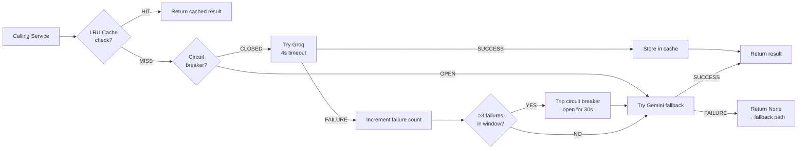

# ResQGrid — System Architecture

> **Technical Architecture Document**
> Covers: System topology, component interactions, data flow, concurrency model, and design decisions

---

## Table of Contents

1. [Architecture Overview](#1-architecture-overview)
2. [System Topology Diagram](#2-system-topology-diagram)
3. [Backend Architecture](#3-backend-architecture)
4. [The Ingest Pipeline (Detailed)](#4-the-ingest-pipeline-detailed)
5. [Frontend Architecture](#5-frontend-architecture)
6. [Real-Time Event System](#6-real-time-event-system)
7. [Concurrency & Background Tasks](#7-concurrency--background-tasks)
8. [AI/ML Architecture](#8-aiml-architecture)
9. [Database Architecture](#9-database-architecture)
10. [API Layer Architecture](#10-api-layer-architecture)
11. [Configuration & Environment](#11-configuration--environment)
12. [Data Initialization & Seeding](#12-data-initialization--seeding)
13. [Error Handling & Resilience Architecture](#13-error-handling--resilience-architecture)
14. [Performance Architecture](#14-performance-architecture)
15. [Repository Structure](#15-repository-structure)

---

## 1. Architecture Overview

ResQGrid is a **monorepo full-stack application** consisting of two independent but tightly integrated services:

1. **Backend** (Python/FastAPI): Handles all data processing, persistence, AI integration, and real-time event broadcasting
2. **Frontend** (React/TypeScript): Provides the dispatcher command center, field team views, public citizen interface, and analytics dashboard

The services communicate via:
- **REST API** (`/api/*` prefix) for all request-response interactions
- **WebSocket** (`/api/ws`) for real-time server-to-client event streaming

Both services run locally during development, with the frontend's Vite dev server proxying all `/api` requests and WebSocket connections to the FastAPI backend on port 8000.

### Architecture Classification

| Dimension | Classification |
|---|---|
| Pattern | Event-Driven Monolith |
| API Style | REST + WebSocket |
| Concurrency Model | Async/Await (asyncio) |
| Data Storage | Single SQLite database |
| Process Model | Single process (no worker separation) |
| Deployment | Local (no containerization required) |

---

## 2. System Topology Diagram

```mermaid
graph TB
    subgraph Clients
        CITIZEN[Citizen Browser<br/>/report]
        DISPATCHER[Dispatcher Browser<br/>/console]
        FIELD[Field Team Browser<br/>/team/:unitId]
        HOSPITAL[Hospital Browser<br/>/hospital/:id]
    end

    subgraph Frontend["Frontend (Vite :5173)"]
        REACT[React App<br/>React Router v6]
        ZUSTAND[Zustand Stores<br/>incidents/units/alerts]
        WSCS[WebSocket Client<br/>auto-reconnect]
        API_SVC[api.ts<br/>fetch wrappers]
    end

    subgraph Backend["Backend (FastAPI :8000)"]
        FASTAPI[FastAPI App<br/>main.py]

        subgraph API_Layer["API Layer (app/api/)"]
            INGEST_API[ingest.py<br/>POST /ingest/*]
            INC_API[incidents.py<br/>GET/PATCH/POST incidents]
            UNITS_API[units.py<br/>units/facilities/dispatch/snapshot]
            ALERTS_API[alerts.py<br/>GET/POST alerts]
            ANALYTICS_API[analytics.py<br/>GET /analytics/*]
            AI_API[ai.py<br/>POST /ai/*]
            SIM_API[sim.py<br/>POST /sim/*]
            NOTIF_API[notifications.py<br/>GET /notifications]
            WS_API[ws.py<br/>WebSocket /ws]
            TRACK_API[track.py<br/>GET /track/:id]
        end

        subgraph Services["Services (app/services/)"]
            PIPELINE[pipeline.py<br/>ingest_report orchestrator]
            CLASSIFY[classify.py<br/>type/severity/priority]
            GEOCODE[geocode.py<br/>location resolution]
            DEDUPE[dedupe.py<br/>similarity scoring]
            PRIORITY[priority.py<br/>deterministic priority]
            RECOMMEND[recommend.py<br/>resource matching]
            DISPATCH[dispatch.py<br/>assignment lifecycle]
            SLA[sla.py<br/>alert rules + escalation]
            NOTIFY[notify.py<br/>channel routing]
            AI_ASSIST[ai_assist.py<br/>summary/SOP/brief/query]
            ANALYTICS_SVC[analytics.py<br/>KPI computation]
            SIMULATOR[simulator.py<br/>demo engine]
            GEOCODE_SVC[geocode.py<br/>location resolution]
            GEO[geo.py<br/>haversine/ETA]
        end

        subgraph Core["Core (app/core/)"]
            LLM[llm.py<br/>Groq+Gemini client<br/>circuit breaker + cache]
            CONFIG[config.py<br/>Pydantic Settings]
            EVENTS[events.py<br/>EventBus + ConnectionManager]
        end

        subgraph DB["Database (app/db/)"]
            MODELS[models.py<br/>SQLAlchemy ORM]
            SESSION[session.py<br/>async engine + sessionmaker]
            SQLITE[(SQLite<br/>resq.db)]
        end

        subgraph Background["Background Tasks"]
            SLA_LOOP[SLA Loop<br/>every 5s]
            MOVER_LOOP[Unit Mover<br/>every 2s]
            AMBIENT_LOOP[Ambient Feed<br/>every 25-40s]
        end
    end

    subgraph External["External Services (optional)"]
        GROQ[Groq API<br/>llama-3.3-70b]
        GEMINI[Google Gemini<br/>gemini-2.0-flash]
        TWILIO[Twilio SMS]
        SMTP[SMTP Email]
    end

    CITIZEN --> REACT
    DISPATCHER --> REACT
    FIELD --> REACT
    HOSPITAL --> REACT

    REACT --> API_SVC
    REACT --> WSCS
    API_SVC --> FASTAPI
    WSCS <--> WS_API

    FASTAPI --> API_Layer
    INGEST_API --> PIPELINE
    PIPELINE --> CLASSIFY
    PIPELINE --> GEOCODE
    PIPELINE --> DEDUPE
    PIPELINE --> PRIORITY
    PIPELINE --> RECOMMEND
    PIPELINE --> SLA
    PIPELINE --> NOTIFY

    CLASSIFY --> LLM
    GEOCODE --> LLM
    AI_ASSIST --> LLM
    LLM --> GROQ
    LLM --> GEMINI

    NOTIFY --> TWILIO
    NOTIFY --> SMTP

    PIPELINE --> MODELS
    MODELS --> SESSION
    SESSION --> SQLITE

    EVENTS --> WS_API
    PIPELINE --> EVENTS
    SLA_LOOP --> EVENTS
    MOVER_LOOP --> EVENTS

    ZUSTAND --> WSCS
    ZUSTAND --> API_SVC
```



---

## 3. Backend Architecture

### 3.1 Application Entry Point (`app/main.py`)

The FastAPI application is configured in `main.py` using:
- **Auto-router discovery**: All modules in `app/api/` are inspected for a `router` attribute and automatically mounted under `/api`
- **Lifespan context manager**: Handles startup (DB init, seed, background task launch) and shutdown (background task cancellation)

```python
# Auto-discovery pattern
for module_name in (files in app/api/):
    mod = importlib.import_module(f"app.api.{module_name}")
    if hasattr(mod, "router"):
        app.include_router(mod.router, prefix="/api")
```

**Startup sequence:**
1. `init_db()` — Creates all SQLAlchemy tables if not present
2. `seed_if_empty()` — Runs seed data script if incident count = 0
3. `train_classifier()` — Loads/trains scikit-learn model from `training_sentences.json`
4. `sla.start(app)` — Launches the 5-second SLA evaluation background loop
5. `simulator.start(app)` — Launches the unit mover (2s) and ambient feed loops

**CORS configuration** allows the frontend origin (localhost:5173 by default, configurable via `CORS_ORIGINS`).

### 3.2 Service Layer Contracts

All services are pure async functions that take primitive types and return dictionaries. They open their own database sessions internally (via `SessionLocal`). This design:
- Enables independent testing of each service
- Prevents session leakage between pipeline stages
- Allows services to be called from both API handlers and background loops

### 3.3 Backend Module Map

```
backend/
  app/
    main.py                 # App factory, CORS, router autodiscovery, lifespan
    core/
      config.py             # Pydantic BaseSettings — all env vars with defaults
      events.py             # EventBus singleton, ConnectionManager singleton
      llm.py                # LLM client: Groq primary, Gemini fallback, circuit breaker, LRU cache
    db/
      models.py             # All 11 SQLAlchemy ORM classes
      session.py            # Engine, SessionLocal, get_session dependency, init_db
    api/
      ingest.py             # POST /ingest/{citizen|call|sensor|field|hospital|department}
      incidents.py          # GET/PATCH /incidents; POST merge/split
      units.py              # GET/PATCH /units, /facilities; POST approve/recommend; GET /snapshot
      alerts.py             # GET /alerts; POST ack/escalate
      analytics.py          # GET /analytics/{overview|types|delays|shortages|hotspots|timeseries|sources}
      ai.py                 # POST /ai/{incident summary|sop|brief|query}
      sim.py                # POST/GET /sim/*
      notifications.py      # GET /notifications
      ws.py                 # WebSocket /ws endpoint
      track.py              # GET /track/{track_id}
    services/
      pipeline.py           # Central ingest orchestrator
      classify.py           # Type/severity/priority classification
      geocode.py            # Location resolution (explicit→gazetteer→fuzzy→LLM→default)
      dedupe.py             # Multi-factor similarity scoring
      priority.py           # Deterministic priority computation
      recommend.py          # Resource requirement templates + multi-factor matching
      dispatch.py           # Assignment state machine (approve/accept/reject/set_status)
      sla.py                # Alert rules R0-R8 + escalation ladder (L0-L3)
      notify.py             # Multi-channel notification router (in-app/SMS/email)
      ai_assist.py          # AI summary, SOP, brief, NL query + template fallbacks
      analytics.py          # KPI computation from DB
      simulator.py          # Unit mover, ambient feed, scripted scenarios, demo controls
      geo.py                # haversine_km, eta_minutes
    schemas/
      incident.py           # Pydantic models for incident request/response shapes
      unit.py               # Pydantic models for unit, facility, assignment, snapshot
    data/
      gazetteer.json        # 60+ Vadodara landmarks with lat/lng/ward/aliases
      facilities.json       # Hospitals, fire stations, shelters seed data
      units.json            # Response unit seed data (40+ units)
      templates.json        # Notification channel configuration and recipient roles
      sop.json              # Standard operating procedures per incident type
      seed.py               # Idempotent database seeder
      train_data.py         # ML classifier training with labeled sentences
  tests/
    conftest.py             # pytest fixtures: temp DB, LLM mock, session patches
    test_classify.py        # Classification, priority, geocode tests
    test_dedupe.py          # Deduplication scoring and threshold tests
    test_pipeline.py        # End-to-end ingest pipeline integration tests
    test_recommend.py       # Resource recommendation scoring tests
    test_sla.py             # SLA rule evaluation tests
```

---

## 4. The Ingest Pipeline (Detailed)

`pipeline.ingest_report(source: str, payload: dict)` is the central function called for every incoming report. It orchestrates the 7-stage processing sequence.

### 4.1 Pipeline Flowchart

```mermaid
flowchart TD
    START([ingest_report called]) --> VALIDATE

    VALIDATE[1. Validate + Idempotency Check<br/>Reject malformed payloads<br/>Check source+external_id uniqueness]
    VALIDATE -->|Duplicate| SKIP([Return existing report_id])
    VALIDATE -->|Valid| NORMALIZE

    NORMALIZE[2. Normalize Payload<br/>Extract text field from all source types<br/>sensor→formatted text string<br/>call→transcript text<br/>field→text field]
    NORMALIZE --> GEOCODE

    GEOCODE[3. Geocode<br/>geocode.resolve method<br/>explicit lat/lng → 1.0 confidence<br/>gazetteer exact match → 0.9<br/>fuzzy match → 0.6-0.8<br/>LLM extraction → 0.45-0.5<br/>city default → 0.2 uncertain]
    GEOCODE --> CLASSIFY

    CLASSIFY[4. Classify<br/>classify.run method<br/>LLM: Groq→Gemini→None<br/>ML: TF-IDF + LogReg if LLM fails<br/>Rules: sensor type → forced type<br/>Returns type/sev/conf/extracted]
    CLASSIFY --> ACQUIRE_LOCK

    ACQUIRE_LOCK[5. Acquire asyncio.Lock<br/>dedupe_lock prevents<br/>concurrent race conditions<br/>on dedupe scoring]
    ACQUIRE_LOCK --> SAVE_REPORT

    SAVE_REPORT[Save Report to DB<br/>source, text, lat, lng, reliability,<br/>classification JSON, created_at]
    SAVE_REPORT --> DEDUPE

    DEDUPE[6. Dedupe<br/>dedupe.find_candidates<br/>Score all active incidents < 60min<br/>4-factor weighted formula]
    DEDUPE -->|score ≥ 0.65| MERGE
    DEDUPE -->|0.45 ≤ score < 0.65| RELATED
    DEDUPE -->|score < 0.45| NEW_INCIDENT

    MERGE[7a. Merge into existing incident<br/>Update report_count, sources, severity,<br/>people_affected, hazards, confidence<br/>Recompute priority<br/>Append to decision_log]
    RELATED[7b. Mark as related<br/>Link in decision_log<br/>Create incident if none primary found]
    NEW_INCIDENT[7c. Create new incident<br/>type/severity/priority from classification<br/>SLA due_at = now + SLA_minutes × scale<br/>Generate unique code INC-XXXX<br/>Generate public track_id]

    MERGE --> POST_PIPELINE
    RELATED --> POST_PIPELINE
    NEW_INCIDENT --> POST_PIPELINE

    POST_PIPELINE[8. Post-pipeline<br/>Release dedupe_lock<br/>Publish incident.upsert event<br/>asyncio.ensure_future for:]

    POST_PIPELINE --> RECOMMEND_ASYNC[Recommend resources async<br/>recommend.plan in background]
    POST_PIPELINE --> SLA_ASYNC[SLA evaluation async<br/>sla.evaluate_incident in background]
    POST_PIPELINE --> NOTIFY_ASYNC[Notify async<br/>notify.route in background]
    POST_PIPELINE --> RETURN

    RETURN([Return: report_id, incident_id,<br/>action: new|merged|related,<br/>classification, track_id])
```

### 4.2 Concurrency Controls

The pipeline uses `asyncio.Lock` for the deduplication stage to prevent race conditions:

```python
_ingestion_lock = asyncio.Lock()

async def ingest_report(source, payload):
    # ... geocode and classify without lock ...
    
    async with _ingestion_lock:
        # Find candidates, merge/relate/create
        # This section is atomic per-process
        ...
    
    # Post-pipeline: non-blocking, non-critical
    asyncio.ensure_future(recommend.plan(incident_id))
    asyncio.ensure_future(sla.evaluate_incident(incident_id))
    asyncio.ensure_future(notify.route(event, incident_id, data))
```

The `asyncio.ensure_future` pattern ensures that expensive post-pipeline operations (resource matching, SLA evaluation, notification dispatch) do not block the pipeline response, while still executing reliably.

### 4.3 Idempotency

Reports are identified by `(source, external_id)`. If the same combination arrives twice (e.g., sensor retransmit), the pipeline returns the existing `report_id` without reprocessing. Sensors and field teams typically provide `external_id`; citizen/call reports generate UUIDs as `external_id` if none is provided.

---

## 5. Frontend Architecture

### 5.1 Application Structure

```
frontend/
  src/
    app/
      App.tsx               # Root with Router, layout, WS init
      routes.tsx            # Route definitions
    pages/
      Console/              # Main dispatcher dashboard
      Analytics/            # Analytics dashboard
      Report/               # Citizen report form
      Team/                 # Field team mobile view
      Track/                # Public incident tracking
      Hospital/             # Hospital capacity view
      Simulator/            # Demo control panel
    components/
      map/                  # LiveMap, IncidentMarker, UnitMarker, FacilityLayer, SensorLayer, HeatLayer
      incident/             # IncidentQueue, IncidentDrawer, IncidentCard
      alerts/               # AlertsPanel, AlertCard
      charts/               # TypeChart, TimeSeriesChart, DelayChart, ShortageChart
      ui/                   # Card, Button, Badge, Toggle, Modal, Toast, Skeleton
    store/
      incidents.ts          # Zustand incident store (apply upsert/WS events)
      units.ts              # Zustand unit store
      alerts.ts             # Zustand alert store
      notifications.ts      # Zustand notification store
      ui.ts                 # UI state (selected incident, drawer open, filters)
    services/
      api.ts                # Typed fetch wrappers for all REST endpoints
      ws.ts                 # WebSocket connection with auto-reconnect + backoff
      mock.ts               # Mock data mode (VITE_USE_MOCK=true)
    hooks/
      useWebSocket.ts       # WS connection hook
      useSnapshot.ts        # Bootstrap GET /snapshot into stores
    types/
      domain.ts             # All TypeScript domain interfaces (IncidentOut, UnitOut, etc.)
    utils/
      format.ts             # Severity/priority color maps, type icons, status labels
      geo.ts                # Haversine distance, bearing calculation
      time.ts               # Relative time formatting, SLA countdown
    styles/
      tokens.css            # CSS custom properties for design tokens
```

### 5.2 State Management with Zustand

Each domain entity has a dedicated Zustand store:

```typescript
// incidents store (simplified)
interface IncidentStore {
  incidents: Map<string, IncidentOut>;
  filters: IncidentFilters;
  upsertIncident: (incident: IncidentOut) => void;
  setFilter: (filter: Partial<IncidentFilters>) => void;
  getSorted: () => IncidentOut[];  // P1 first, then by age
}
```

WebSocket events are applied to stores idempotently:
- `incident.upsert` → `incidentStore.upsertIncident(payload)`
- `unit.update` → `unitStore.upsertUnit(payload)`
- `alert.new` → `alertStore.addAlert(payload)`
- `alert.ack` → `alertStore.ackAlert(payload.id)`
- `notification.new` → `notificationStore.addNotification(payload)`
- `kpi.update` → `uiStore.setKPIs(payload)`
- `sim.state` → `uiStore.setSimState(payload)`
- `sensor.update` → `unitStore.upsertSensor(payload)` (sensors stored alongside units)

### 5.3 WebSocket Client

The WS client uses exponential backoff on reconnect:

```typescript
// backoff sequence: 1s → 2s → 4s → 8s → max 30s
const connect = async () => {
  ws = new WebSocket(`${wsOrigin}/api/ws?role=${role}`);
  ws.onclose = () => scheduleReconnect();
  ws.onmessage = (e) => applyEvent(JSON.parse(e.data));
};

const scheduleReconnect = () => {
  reconnectDelay = Math.min(reconnectDelay * 2, MAX_DELAY);
  setTimeout(connect, reconnectDelay);
};
```

On reconnect, `useSnapshot` fetches `GET /api/snapshot` to re-hydrate stores with current state, then the WS stream resumes delivering incremental updates.

### 5.4 Mock Mode

When `VITE_USE_MOCK=true` (or backend unreachable), the frontend switches to `mock.ts` which provides:
- In-memory snapshot with ~8 incidents, ~25 units, ~10 facilities, ~8 sensors
- Fake event emitter that periodically fires `incident.upsert` and `unit.update` events
- All API calls return mock responses

A small "Demo data" badge is shown in the UI header when mock mode is active.

---

## 6. Real-Time Event System

### 6.1 EventBus Architecture

The `EventBus` in `app/core/events.py` is an in-process pub/sub system that also broadcasts to all connected WebSocket clients:

```python
class EventBus:
    def __init__(self, connection_manager):
        self.manager = connection_manager
        self._subscribers = []  # in-process listeners
    
    async def publish(self, event_type: str, payload: dict):
        envelope = {"type": event_type, "ts": now_utc, "payload": payload}
        
        # 1. Broadcast to all WebSocket clients
        await self.manager.broadcast(envelope)
        
        # 2. Notify in-process subscribers
        for sub in self._subscribers:
            result = sub(event_type, payload)
            if asyncio.iscoroutine(result):
                asyncio.create_task(result)

bus = EventBus(manager)  # singleton
```

### 6.2 Event Catalog

| Event Type | Trigger | Payload Shape |
|---|---|---|
| `incident.upsert` | Any incident state change | IncidentOut |
| `report.new` | New report saved | ReportOut |
| `unit.update` | Unit position/status change | UnitOut |
| `sensor.update` | Sensor state/value change | SensorOut |
| `alert.new` | New alert created or level changed | AlertOut |
| `alert.ack` | Alert acknowledged | AlertOut |
| `alert.resolved` | Alert resolved | AlertOut |
| `notification.new` | New in-app notification | NotificationOut |
| `kpi.update` | KPI metrics changed | kpis dict |
| `sim.state` | Simulator state changed | sim dict |

### 6.3 ConnectionManager

The `ConnectionManager` maintains a list of active WebSocket connections with thread-safe (asyncio-safe) broadcasting:

```python
class ConnectionManager:
    def __init__(self):
        self.active_connections: List[WebSocket] = []
        self._lock = asyncio.Lock()
    
    async def broadcast(self, message: dict):
        # Serialize once, send to all
        text = dumps_json(message)
        dead = []
        for ws in list(self.active_connections):
            try:
                await ws.send_text(text)
            except Exception:
                dead.append(ws)  # mark for cleanup
        # Clean up dead connections
```

Dead connections (browser closed, network failure) are detected during broadcast and removed from the pool without blocking other recipients.

### 6.4 WebSocket Lifecycle

```
Client connects to /api/ws?role=dispatcher
       ↓
ConnectionManager.connect() → accept + register
       ↓
Server sends "connection.established" hello
       ↓
Main loop: wait for client message with 20s timeout
  - Client sends "ping" → server responds "pong"
  - Timeout → server sends keepalive ping
  - Client sends JSON ping → server sends JSON pong
       ↓
Any publish() call → broadcast to all connected clients
       ↓
WebSocketDisconnect → ConnectionManager.disconnect()
```

---

## 7. Concurrency & Background Tasks

### 7.1 Asyncio Task Architecture

ResQGrid uses Python's `asyncio` event loop for all concurrency. Three background tasks run continuously:

```
FastAPI Event Loop
├── Request handlers (API endpoints)
├── SLA Monitor (asyncio.Task)
│   └── _sla_loop() → every 5s → _run_sla_checks()
│       ├── Evaluate R1-R5 rules per active incident
│       ├── Evaluate R6 (sensor cluster) globally
│       ├── Evaluate R7 (regional surge) globally
│       ├── Advance R8 (duplicate cluster) per incident
│       └── Progress escalation ladder for open alerts
├── Unit Mover (asyncio.Task)
│   └── _mover_loop() → every 2s
│       ├── Autopilot: advance approved→en_route after 3s
│       ├── Move en_route units toward incident GPS
│       └── Autopilot: advance arrived→completed after 25s×scale
└── Ambient Feed (asyncio.Task)
    └── _ambient_loop() → every 25-40s (when enabled)
        └── ingest_report() with random AMBIENT_REPORT
```

### 7.2 Task Lifecycle Management

All background tasks are managed through the lifespan context manager:

```python
@asynccontextmanager
async def lifespan(app):
    # Startup
    await init_db()
    await seed_if_empty()
    sla.start(app)      # creates asyncio task
    simulator.start(app) # creates two asyncio tasks
    yield
    # Shutdown
    sla.stop()          # cancels sla task
    simulator.stop()    # cancels all simulator tasks
```

The `start(app)` pattern allows adding future integrations (e.g., Kafka consumer) without changing the lifespan structure.

### 7.3 Post-Pipeline Non-Blocking Execution

After the core pipeline completes (incident created/merged, report saved), secondary operations are scheduled as fire-and-forget futures:

```python
asyncio.ensure_future(recommend.plan(incident_id))
asyncio.ensure_future(sla.evaluate_incident(incident_id))
asyncio.ensure_future(notify.route(event, incident_id, data))
```

This pattern:
- Returns the API response to the client immediately (< 3s target)
- Executes recommendation, SLA, and notification in the background
- Never blocks the caller on slow operations
- Uses a best-effort semantics (failure is logged, not re-tried for recommendations)

### 7.4 The Dedupe Lock

A single `asyncio.Lock()` protects the deduplification + incident creation phase:

```python
_ingestion_lock = asyncio.Lock()

async def ingest_report(...):
    # ... stages 1-4 without lock ...
    
    async with _ingestion_lock:
        # Stage 5: Dedupe + Create/Merge (atomic)
        candidates = await dedupe.find_candidates(session, report, classification)
        if best_match_score >= MERGE_T:
            await merge_into(existing_incident, report, session)
        elif best_match_score >= RELATED_T:
            await relate(existing_incident, report, session)
        else:
            incident = await create_new(report, classification, session)
    
    # ... stages 6-7 after lock release ...
```

Without this lock, two concurrent reports describing the same fire could both pass the "no existing incident" check and both create new incidents before either commit is visible to the other.

---

## 8. AI/ML Architecture

### 8.1 LLM Client (`app/core/llm.py`)

The LLM client implements a robust production-grade pattern for unreliable external services:



Key design decisions:
- **4-second timeout** on all LLM calls prevents blocking the pipeline
- **Circuit breaker** trips after 3 consecutive failures; resets after 30 seconds
- **LRU cache** (100 entries) deduplicates identical prompts within the process lifetime
- **Strict JSON schema**: All LLM outputs are validated as JSON; malformed responses treated as failures

### 8.2 Classification ML Fallback

When the LLM returns None, the classifier falls back to a local scikit-learn model:

```python
# Training data: ~150 labeled sentences per type (loaded from training_sentences.json)
# Model: TfidfVectorizer(ngram_range=(1,2)) + LogisticRegression
# Trained at startup via classify.train_classifier()

_vectorizer: TfidfVectorizer
_classifier: LogisticRegression

def _ml_classify(text: str) -> str:
    vec = _vectorizer.transform([text])
    return _classifier.predict(vec)[0]  # returns type string
```

If the ML model also fails (e.g., import error), the system falls through to keyword rule matching:

```python
def _rule_type(text: str) -> str:
    lower = text.lower()
    if any(w in lower for w in ("fire", "flame", "burning")):
        return "fire"
    if any(w in lower for w in ("flood", "river", "water level")):
        return "flood"
    # ... more rules ...
    return "other"
```

### 8.3 Deduplication ML Component

The deduplication text scoring uses scikit-learn's `TfidfVectorizer` directly:

```python
def _text_score(inc_texts: List[str], rep_text: str) -> float:
    corpus = inc_texts + [rep_text]
    vec = TfidfVectorizer(ngram_range=(1, 2), max_features=500)
    mat = vec.fit_transform(corpus)
    # Cosine similarity: new report vs. centroid of existing texts
    sims = cosine_similarity(mat[-1], mat[:-1])
    return float(sims.max())
```

This is a pure local computation with no external dependencies.

### 8.4 AI Assist Services

All AI assist calls (`ai_assist.py`) follow the same LLM-with-template-fallback pattern:

```python
async def get_summary(incident_id: str) -> dict:
    incident = await load_incident(incident_id)
    
    # Cache check (keyed by incident_id + report_count)
    cache_key = (incident_id, incident.report_count)
    if cache_key in _summary_cache:
        return _summary_cache[cache_key]
    
    # Try LLM
    result = await _llm_summary(ctx)
    if result:
        _summary_cache[cache_key] = result
        return result
    
    # Template fallback
    return _template_summary(incident)
```

The template fallbacks produce coherent, useful responses without any LLM access.

---

## 9. Database Architecture

### 9.1 Database Choice: SQLite + aiosqlite

SQLite was chosen for:
- **Zero setup**: No server to configure or start
- **Async support**: `aiosqlite` provides a non-blocking SQLite driver for asyncio
- **Easy migration**: `DATABASE_URL` can be changed to PostgreSQL format without code changes
- **Demonstration stability**: No network dependencies; works offline

### 9.2 SQLAlchemy 2 Async Pattern

```python
# session.py
engine = create_async_engine(settings.DATABASE_URL)
SessionLocal = async_sessionmaker(engine, expire_on_commit=False)

async def get_session() -> AsyncGenerator[AsyncSession, None]:
    async with SessionLocal() as session:
        yield session  # FastAPI Depends pattern
```

The `expire_on_commit=False` setting allows accessing ORM attributes after commit without reloading from DB, important for serialization after writes.

### 9.3 Custom Column Types

The schema uses two custom SQLAlchemy column types:

**UTCDateTime**: Ensures all stored datetimes are UTC timezone-aware:
```python
class UTCDateTime(TypeDecorator):
    impl = DateTime(timezone=True)
    
    def process_result_value(self, value, dialect):
        if value and value.tzinfo is None:
            return value.replace(tzinfo=timezone.utc)
        return value
```

**JSONColumn**: Stores Python lists/dicts as JSON strings in SQLite (SQLite has no native JSON type with full support):
```python
class JSONColumn(TypeDecorator):
    impl = Text
    
    def process_bind_param(self, value, dialect):
        return json.dumps(value) if value is not None else None
    
    def process_result_value(self, value, dialect):
        return json.loads(value) if value else None
```

### 9.4 Entity Relationship Summary

```
Report ──────────────── Incident (FK: incident_id)
                              │
                    ┌─────────┴─────────┐
                    │                   │
                Assignment          Shortage
                    │                   │
                 Unit FK         (subtype, qty_missing)
                 Facility FK
                    │
                 Alert (incident_id or NULL for global)
                    │
               Notification (incident_id optional)
                    │
               AuditEvent (entity_id = any entity)
                    │
                 Sensor (standalone, no FK)
```

---

## 10. API Layer Architecture

### 10.1 Router Autodiscovery

`main.py` scans `app/api/` and mounts all modules with a `router` attribute:
```python
for f in Path("app/api").glob("*.py"):
    mod = importlib.import_module(f"app.api.{f.stem}")
    if hasattr(mod, "router"):
        app.include_router(mod.router, prefix="/api")
```

This means adding a new API module requires no changes to `main.py`.

### 10.2 Request Processing Pattern

Every API handler follows this pattern:

```python
@router.post("/incidents/{id}/approve")
async def approve(
    id: str,
    body: ApproveRequest,
    session: AsyncSession = Depends(get_session)  # auto-managed session
):
    # 1. Validate input
    # 2. Load entity (404 if not found)
    # 3. Call service function
    # 4. Return response
```

### 10.3 Error Handling

All API handlers use `HTTPException` with standard HTTP codes:
- `400`: Invalid input values
- `404`: Entity not found
- `422`: Validation error (Pydantic auto-generates)
- `500`: Unhandled server error (FastAPI default)

Services never raise HTTP exceptions — they return `None` or empty results. Only API handlers raise `HTTPException`.

---

## 11. Configuration & Environment

All configuration flows through `app/core/config.py` using Pydantic's `BaseSettings`:

```python
class Settings(BaseSettings):
    DATABASE_URL: str = "sqlite+aiosqlite:///./resq.db"
    GROQ_API_KEY: str = ""
    GROQ_MODEL: str = "llama-3.3-70b-versatile"
    GEMINI_API_KEY: str = ""
    GEMINI_MODEL: str = "gemini-2.0-flash"
    TWILIO_ACCOUNT_SID: str = ""
    TWILIO_AUTH_TOKEN: str = ""
    TWILIO_FROM: str = ""
    SMTP_HOST: str = ""
    SMTP_PORT: int = 587
    SMTP_USER: str = ""
    SMTP_PASS: str = ""
    DEFAULT_SMS_TO: str = ""
    DEFAULT_EMAIL_TO: str = ""
    SLA_TIME_SCALE: float = 1.0  # demo speedup multiplier
    AUTO_DISPATCH_P1: bool = False
    CORS_ORIGINS: str = "http://localhost:5173,http://127.0.0.1:5173"
    DEFAULT_CITY_LAT: float = 22.30
    DEFAULT_CITY_LNG: float = 73.19
    LLM_TIMEOUT_S: float = 4.0

    class Config:
        env_file = ".env"
        env_file_encoding = "utf-8"

settings = Settings()  # singleton
```

All configuration defaults enable zero-key operation.

---

## 12. Data Initialization & Seeding

### 12.1 Seed Script (`app/data/seed.py`)

The seeder is idempotent — it checks if any units exist before running:

```python
async def seed_if_empty():
    async with SessionLocal() as session:
        unit_count = await session.scalar(select(func.count(Unit.id)))
        if unit_count > 0:
            return  # Already seeded
        
        await _seed_facilities(session)   # hospitals, fire stations, shelters
        await _seed_units(session)        # fire crews, ambulances, boats, etc.
        await _seed_sensors(session)      # flood gauges, gas detectors, etc.
        await _seed_incidents(session)    # ~300 historic incidents (is_historic=True)
        await session.commit()
```

### 12.2 ML Classifier Training (`app/data/train_data.py`)

At startup, the classification model is trained using labeled sentences from `training_sentences.json`:

```python
# ~150 labeled examples per type × 8 types = ~1200 training examples
training = {
  "fire": ["building on fire near RC Dutt road", ...],
  "flood": ["paani bhar gaya road par", ...],
  # ... 6 more types
}
```

Training takes < 1 second on startup; the model is held in-memory.

---

## 13. Error Handling & Resilience Architecture

### 13.1 Fail-Safe Service Design

Every service function that interacts with external systems:
1. Wraps all code in `try/except Exception`
2. Logs warnings instead of raising errors
3. Returns `None` or a fallback value

Example from `sla.py`:
```python
async def evaluate_incident(incident_id: str) -> None:
    try:
        async with SessionLocal() as session:
            # ... SLA evaluation logic ...
    except Exception as exc:
        logger.warning("evaluate_incident failed: %s", exc)
        # Never raises — silently swallows all errors
```

### 13.2 Notification Resilience

`notify.route()` is explicitly documented as "guaranteed never to raise":
```python
async def route(event, incident_id, data) -> None:
    try:
        # ... notification logic ...
    except Exception as exc:
        logger.warning("notify.route failed (handled safely): %s", exc)
```

This ensures that a failure in Twilio SMS or SMTP never blocks incident processing.

### 13.3 WebSocket Resilience

Dead WebSocket connections are detected and removed during broadcast, preventing error accumulation.

The frontend implements exponential backoff reconnection with a maximum 30-second delay.

### 13.4 Database Connection Resilience

SQLAlchemy's `expire_on_commit=False` prevents lazy-load errors after commits. All service functions open fresh sessions rather than reusing sessions across async boundaries.

---

## 14. Performance Architecture

### 14.1 Response Time Targets

| Operation | Target | Mechanism |
|---|---|---|
| LLM classification path | < 3 seconds | Groq's fast inference + 4s timeout |
| ML/rule classification path | < 500ms | Local computation, no network |
| Full ingest pipeline (LLM) | < 4 seconds | Parallel geocode + classify; post-pipeline async |
| Full ingest pipeline (ML) | < 1 second | All local operations |
| GET /snapshot | < 500ms | Single DB scan with parallel serialization |
| WebSocket event delivery | < 100ms | In-process broadcast, no serialization overhead |

### 14.2 LRU Cache

The LLM client maintains a 100-entry LRU cache keyed by `(prompt_hash, system_hash)`. Identical prompts (e.g., repeated sensor breach reports with the same text) hit the cache and return in microseconds.

AI assist functions have additional in-memory caches:
- Summary cache: keyed by `(incident_id, report_count)` — invalidated when new reports arrive
- Brief cache: TTL of 30 seconds (global brief)

### 14.3 Database Query Patterns

- No N+1 queries: Incident serialization uses a single `SELECT assignments WHERE incident_id IN (...)` rather than one query per incident
- `is_historic` flag separates seed data from live data, preventing slow scans of all 300+ historic records in operational queries
- 60-minute time window on deduplication candidate queries limits the candidate pool regardless of total incident count

---

## 15. Repository Structure

```
BitNBuild_Just-Us-League/
├── README.md                    # Project overview and setup
├── PROMPT_FE.md                 # Frontend development specification
├── run.bat                      # Windows one-command startup
├── run.sh                       # Linux/Mac one-command startup
├── backend/
│   ├── requirements.txt         # Python dependencies
│   ├── .env.example             # Environment variable template
│   ├── app/
│   │   ├── main.py              # FastAPI application factory
│   │   ├── core/
│   │   │   ├── config.py        # Pydantic settings
│   │   │   ├── events.py        # EventBus + ConnectionManager
│   │   │   └── llm.py           # LLM client with circuit breaker
│   │   ├── db/
│   │   │   ├── models.py        # SQLAlchemy ORM models
│   │   │   └── session.py       # Database engine and session factory
│   │   ├── api/
│   │   │   ├── ingest.py        # Multi-source ingest endpoints
│   │   │   ├── incidents.py     # Incident CRUD + merge/split
│   │   │   ├── units.py         # Units, facilities, dispatch, snapshot
│   │   │   ├── alerts.py        # Alert management
│   │   │   ├── analytics.py     # Analytics data endpoints
│   │   │   ├── ai.py            # AI assistance endpoints
│   │   │   ├── sim.py           # Simulator controls
│   │   │   ├── notifications.py # Notification outbox
│   │   │   ├── ws.py            # WebSocket endpoint
│   │   │   └── track.py         # Public tracking endpoint
│   │   ├── schemas/
│   │   │   ├── incident.py      # Incident Pydantic schemas
│   │   │   └── unit.py          # Unit/facility/assignment schemas
│   │   ├── services/
│   │   │   ├── pipeline.py      # Central ingest orchestrator
│   │   │   ├── classify.py      # Classification service
│   │   │   ├── geocode.py       # Location resolution service
│   │   │   ├── dedupe.py        # Deduplication service
│   │   │   ├── priority.py      # Priority computation
│   │   │   ├── recommend.py     # Resource recommendation
│   │   │   ├── dispatch.py      # Assignment state machine
│   │   │   ├── sla.py           # SLA monitoring + escalation
│   │   │   ├── notify.py        # Multi-channel notifications
│   │   │   ├── ai_assist.py     # AI assistance functions
│   │   │   ├── analytics.py     # Analytics computation
│   │   │   ├── simulator.py     # Demo simulator engine
│   │   │   └── geo.py           # Haversine and ETA functions
│   │   └── data/
│   │       ├── seed.py           # Database seeder
│   │       ├── train_data.py     # ML classifier trainer
│   │       ├── gazetteer.json    # Vadodara landmarks
│   │       ├── facilities.json   # Hospital/station seed data
│   │       ├── units.json        # Response unit seed data
│   │       ├── templates.json    # Notification templates
│   │       └── sop.json          # Standard operating procedures
│   └── tests/
│       ├── conftest.py           # pytest fixtures
│       ├── test_classify.py      # Classification and geocode tests
│       ├── test_dedupe.py        # Deduplication tests
│       ├── test_pipeline.py      # Integration tests
│       ├── test_recommend.py     # Recommendation tests
│       └── test_sla.py           # SLA rule tests
├── frontend/
│   ├── package.json             # Node.js dependencies
│   ├── tsconfig.json            # TypeScript configuration
│   ├── vite.config.ts           # Vite + proxy configuration
│   ├── tailwind.config.js       # Tailwind design tokens
│   └── src/                     # React TypeScript source
└── Docs/                        # This documentation package
    ├── 01_Project_Overview/
    ├── 02_Architecture/          ← You are here
    ├── 03_Backend_Technical/
    ├── 04_Frontend_Technical/
    ├── 05_API_Reference/
    ├── 06_AI_ML_Documentation/
    ├── 07_Data_Models/
    ├── 08_Security_And_Resilience/
    ├── 09_Testing/
    ├── 10_Market_and_Research/
    ├── 11_Deployment_and_Operations/
    ├── 12_Roadmap/
    ├── 13_Presentation_Context/
    ├── 14_Team/
    └── 15_Documentation_Audit/
```

---

*This document is part of the ResQGrid documentation package. For specific subsystem documentation, refer to the relevant numbered directory in `Docs/`.*
