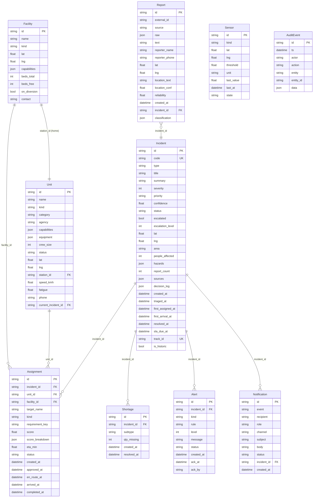

# ResQGrid — Data Models Reference

> **Database Schema, Entity Relationships, and Data Contracts**
> Based on `backend/app/db/models.py` and the frozen API contract

---

## Table of Contents

1. [Database Overview](#1-database-overview)
2. [Custom Column Types](#2-custom-column-types)
3. [Entity: Report](#3-entity-report)
4. [Entity: Incident](#4-entity-incident)
5. [Entity: Unit](#5-entity-unit)
6. [Entity: Facility](#6-entity-facility)
7. [Entity: Assignment](#7-entity-assignment)
8. [Entity: Shortage](#8-entity-shortage)
9. [Entity: Alert](#9-entity-alert)
10. [Entity: Notification](#10-entity-notification)
11. [Entity: Sensor](#11-entity-sensor)
12. [Entity: AuditEvent](#12-entity-auditevent)
13. [Entity Relationship Diagram](#13-entity-relationship-diagram)
14. [Decision Log Structure](#14-decision-log-structure)
15. [Classification JSON Schema](#15-classification-json-schema)
16. [Score Breakdown Schema](#16-score-breakdown-schema)
17. [Notification Templates Schema](#17-notification-templates-schema)
18. [Data Integrity Constraints](#18-data-integrity-constraints)
19. [Seed Data Summary](#19-seed-data-summary)

---

## 1. Database Overview

ResQGrid uses **SQLite** with the `aiosqlite` async driver, managed through **SQLAlchemy 2.0** with async sessions.

- **Database file**: `backend/resq.db` (created automatically on first run)
- **Engine**: `create_async_engine(DATABASE_URL)` with WAL mode for better concurrent reads
- **Session factory**: `async_sessionmaker(engine, expire_on_commit=False)`

### Table Count
11 tables total:

| Table | Purpose |
|---|---|
| `reports` | Raw incoming reports from all sources |
| `incidents` | Unified incident records (deduplicated) |
| `units` | Response teams and vehicles |
| `facilities` | Hospitals, shelters, stations, depots |
| `assignments` | Linkage between incidents and units/facilities |
| `shortages` | Unmet resource requirements |
| `alerts` | SLA rule violations and escalation alerts |
| `notifications` | Multi-channel notification outbox |
| `sensors` | IoT sensor devices and their current readings |
| `audit_events` | Immutable change log for every state transition |

---

## 2. Custom Column Types

### UTCDateTime

Stores timezone-aware UTC datetimes in SQLite (which uses naive datetimes by default):

```python
class UTCDateTime(TypeDecorator):
    """Always returns timezone-aware UTC datetimes."""
    impl = DateTime(timezone=True)
    cache_ok = True

    def process_result_value(self, value, dialect):
        if value is not None and isinstance(value, datetime) and value.tzinfo is None:
            return value.replace(tzinfo=timezone.utc)
        return value
```

All timestamp columns use `UTCDateTime` and default to `func.now()` in UTC.

### JSONColumn

Stores Python lists and dicts as JSON strings (SQLite has no native JSON array type with full ORM support):

```python
class JSONColumn(TypeDecorator):
    """Transparent JSON serialization/deserialization."""
    impl = Text
    cache_ok = True

    def process_bind_param(self, value, dialect):
        if value is not None:
            return json.dumps(value)
        return None

    def process_result_value(self, value, dialect):
        if value:
            try:
                return json.loads(value)
            except (json.JSONDecodeError, TypeError):
                return None
        return None
```

---

## 3. Entity: Report

**Table: `reports`**

Every incoming report (regardless of source channel) is stored as a `Report` record.

| Column | Type | Constraints | Description |
|---|---|---|---|
| `id` | UUID string | PK, NOT NULL | `default=lambda: str(uuid4())` |
| `external_id` | string | UNIQUE (per source) | Source-specific identifier for idempotency |
| `source` | string | NOT NULL | `citizen|call|sensor|field|hospital|department` |
| `raw` | JSONColumn | nullable | Original raw payload dict |
| `text` | string | nullable | Extracted text/transcript |
| `reporter_name` | string | nullable | Name of the reporter |
| `reporter_phone` | string | nullable | Phone number |
| `lat` | float | nullable | Resolved latitude |
| `lng` | float | nullable | Resolved longitude |
| `location_text` | string | nullable | Human-readable location |
| `location_conf` | float | nullable | Geocoding confidence (0.0–1.0) |
| `reliability` | float | nullable | Source reliability weight |
| `created_at` | UTCDateTime | NOT NULL | `default=func.now()` |
| `incident_id` | string | FK→incidents.id, nullable | Linked incident |
| `classification` | JSONColumn | nullable | Full classification result dict |

**Reliability weights by source:**
| Source | Weight |
|---|---|
| `field` | 0.95 |
| `sensor` | 0.90 |
| `department` | 0.90 |
| `call` | 0.80 |
| `hospital` | 0.80 |
| `citizen` | 0.60 |

---

## 4. Entity: Incident

**Table: `incidents`**

The central entity. Each `Incident` represents a single real-world emergency event, potentially aggregating multiple `Report` records.

| Column | Type | Constraints | Description |
|---|---|---|---|
| `id` | UUID string | PK, NOT NULL | `default=lambda: str(uuid4())` |
| `code` | string | UNIQUE, NOT NULL | Human-readable code: `INC-0001`, `INC-0002`, ... |
| `type` | string | NOT NULL | Emergency type (8 values) |
| `title` | string | NOT NULL | Short display title |
| `summary` | string | nullable | AI-generated or rule-based summary |
| `severity` | integer | NOT NULL | 1–5 scale |
| `priority` | string | NOT NULL | `P1|P2|P3|P4` |
| `confidence` | float | NOT NULL | Classification confidence 0.0–1.0 |
| `status` | string | NOT NULL, default `"new"` | Lifecycle status |
| `escalated` | boolean | default `False` | Has any alert escalated this incident? |
| `escalation_level` | integer | default `0` | Current escalation ladder level (0–3) |
| `lat` | float | nullable | Incident location latitude |
| `lng` | float | nullable | Incident location longitude |
| `area` | string | nullable | Ward/area name from gazetteer |
| `people_affected` | integer | default `0` | Extracted count of people affected |
| `hazards` | JSONColumn | default `[]` | List of hazard strings |
| `report_count` | integer | default `1` | Total reports merged into this incident |
| `sources` | JSONColumn | default `[]` | Distinct source channels contributing |
| `decision_log` | JSONColumn | default `[]` | Ordered list of pipeline decision records |
| `created_at` | UTCDateTime | NOT NULL | `default=func.now()` |
| `triaged_at` | UTCDateTime | nullable | When classification completed |
| `first_assigned_at` | UTCDateTime | nullable | When first assignment was approved |
| `first_arrival_at` | UTCDateTime | nullable | When first unit arrived on scene |
| `resolved_at` | UTCDateTime | nullable | When status became `resolved` |
| `sla_due_at` | UTCDateTime | nullable | SLA deadline (priority × scale) |
| `track_id` | string | UNIQUE, nullable | Public tracking ID: `TRK-XXXXXXXX` |
| `is_historic` | boolean | default `False` | True for seed data historic incidents |

**Status Lifecycle:**
```
new → triaged → dispatched → en_route → on_scene → contained → resolved → closed
       (also: escalated flag can be set at any stage)
```

**Code Generation:**
The incident code (`INC-0001`) is assigned sequentially using a DB query:
```python
async def _get_next_incident_code(session) -> str:
    max_code = await session.scalar(
        select(func.max(Incident.code)).where(Incident.code.like("INC-%"))
    )
    next_num = (int(max_code.split("-")[1]) + 1) if max_code else 1
    return f"INC-{next_num:04d}"
```

---

## 5. Entity: Unit

**Table: `units`**

Represents both response teams (category: `team`) and vehicles (category: `vehicle`).

| Column | Type | Constraints | Description |
|---|---|---|---|
| `id` | string | PK, NOT NULL | Stable human-readable IDs (e.g., `"unit-fire-001"`) |
| `name` | string | NOT NULL | Display name ("Fire Engine Alpha") |
| `kind` | string | NOT NULL | Unit subtype (see enumeration) |
| `category` | string | NOT NULL | `team|vehicle` |
| `agency` | string | nullable | Owning agency (e.g., "VMC Fire", "VMSS") |
| `capabilities` | JSONColumn | default `[]` | List of capability strings |
| `equipment` | JSONColumn | default `{}` | Dict of `{item: quantity}` |
| `crew_size` | integer | nullable | Number of crew members |
| `status` | string | NOT NULL, default `"available"` | Current operational status |
| `lat` | float | nullable | Current GPS latitude |
| `lng` | float | nullable | Current GPS longitude |
| `station_id` | string | nullable | Home station facility ID |
| `speed_kmh` | float | default `45.0` | Default travel speed in km/h |
| `fatigue` | float | default `0.0` | Crew fatigue 0.0 (fresh) to 1.0 (exhausted) |
| `phone` | string | nullable | Contact phone number |
| `current_incident_id` | string | nullable | Active incident ID when assigned |
| `updated_at` | UTCDateTime | nullable | Last position/status update |

**Unit Status Lifecycle:**
```
available → assigned → en_route → on_scene → returning → available
                                           └→ offline
```

**Speed defaults by kind** (approximate):
- Fire engine, tanker, crane: 40 km/h
- Ambulance: 60 km/h
- Boat: 20 km/h
- Police, rescue: 50 km/h

**Capability strings** (examples):
`"fire_suppression"`, `"water_rescue"`, `"hazmat"`, `"trauma_care"`, `"search_rescue"`, `"heavy_lifting"`, `"traffic_management"`

---

## 6. Entity: Facility

**Table: `facilities`**

Represents hospitals, shelters, fire stations, police stations, and equipment depots.

| Column | Type | Constraints | Description |
|---|---|---|---|
| `id` | string | PK, NOT NULL | Stable IDs (e.g., `"facility-hospital-ssg"`) |
| `name` | string | NOT NULL | Display name |
| `kind` | string | NOT NULL | `hospital|shelter|fire_station|police_station|eq_depot` |
| `lat` | float | nullable | Location latitude |
| `lng` | float | nullable | Location longitude |
| `capabilities` | JSONColumn | default `[]` | Medical capability strings |
| `beds_total` | integer | nullable | Total bed capacity (hospitals) |
| `beds_free` | integer | nullable | Available beds |
| `on_diversion` | boolean | default `False` | Cannot accept patients |
| `contact` | string | nullable | Phone number |
| `updated_at` | UTCDateTime | nullable | Last capacity update |

**Hospital capability strings:**
`"trauma"`, `"burn"`, `"icu"`, `"pediatric"`, `"toxicology"`, `"neurology"`, `"cardiac"`

---

## 7. Entity: Assignment

**Table: `assignments`**

Tracks the linkage between an incident and a responding unit or facility. Each resource requirement can generate one or more `Assignment` records.

| Column | Type | Constraints | Description |
|---|---|---|---|
| `id` | UUID string | PK, NOT NULL | `default=lambda: str(uuid4())` |
| `incident_id` | string | FK→incidents.id, NOT NULL | Associated incident |
| `unit_id` | string | FK→units.id, nullable | Assigned unit (null if facility) |
| `facility_id` | string | FK→facilities.id, nullable | Assigned facility (null if unit) |
| `target_name` | string | nullable | Denormalized display name |
| `kind` | string | nullable | `team|vehicle|facility` |
| `requirement_key` | string | nullable | Template key that generated this assignment |
| `score` | float | nullable | Overall matching score 0.0–1.0 |
| `score_breakdown` | JSONColumn | nullable | `{proximity, capability, readiness, load}` |
| `eta_min` | float | nullable | Estimated travel time in minutes |
| `status` | string | NOT NULL, default `"recommended"` | Assignment lifecycle status |
| `created_at` | UTCDateTime | NOT NULL | `default=func.now()` |
| `approved_at` | UTCDateTime | nullable | When dispatcher approved |
| `en_route_at` | UTCDateTime | nullable | When unit started moving |
| `arrived_at` | UTCDateTime | nullable | When unit arrived on scene |
| `completed_at` | UTCDateTime | nullable | When assignment completed |

**Status Lifecycle:**
```
recommended → approved → accepted → en_route → arrived → completed
                                  └→ rejected
              └→ cancelled
```

---

## 8. Entity: Shortage

**Table: `shortages`**

Created when the recommendation engine cannot fulfill a resource requirement.

| Column | Type | Constraints | Description |
|---|---|---|---|
| `id` | UUID string | PK, NOT NULL | `default=lambda: str(uuid4())` |
| `incident_id` | string | FK→incidents.id, NOT NULL | Associated incident |
| `subtype` | string | NOT NULL | Resource type that is short (e.g., "hazmat", "boat") |
| `qty_missing` | integer | NOT NULL | Number of units short |
| `created_at` | UTCDateTime | NOT NULL | `default=func.now()` |
| `resolved_at` | UTCDateTime | nullable | When shortage was resolved (unit became available) |

---

## 9. Entity: Alert

**Table: `alerts`**

Created by the SLA monitoring engine when rules R0–R8 are violated.

| Column | Type | Constraints | Description |
|---|---|---|---|
| `id` | UUID string | PK, NOT NULL | `default=lambda: str(uuid4())` |
| `incident_id` | string | FK→incidents.id, nullable | Associated incident (null for global alerts like R6, R7) |
| `kind` | string | NOT NULL | Alert category |
| `rule` | string | NOT NULL | Specific rule identifier (e.g., "R1_UNASSIGNED_SLA") |
| `level` | integer | NOT NULL, default `0` | Current escalation level (0–3) |
| `message` | string | NOT NULL | Human-readable alert message |
| `status` | string | NOT NULL, default `"open"` | `open|ack|resolved` |
| `created_at` | UTCDateTime | NOT NULL | `default=func.now()` |
| `ack_at` | UTCDateTime | nullable | When acknowledged |
| `ack_by` | string | nullable | Who acknowledged |

**SLA Rules:**

| Rule Key | Kind | Level | Trigger |
|---|---|---|---|
| `R0_P1_CRITICAL` | critical | 0 | P1 incident created or severity ≥ 5 |
| `R1_UNASSIGNED_SLA` | delayed | 0 | Incident not assigned within SLA due time |
| `R2_ASSIGNED_NOT_ENROUTE_{id}` | delayed | 0 | Assignment approved >2min without en_route |
| `R3_ETA_OVERRUN_{id}` | delayed | 0 | ETA exceeded by >50% |
| `R4_HIGH_SEVERITY` | escalation | 0 | Active incident with severity ≥ 4 |
| `R5_SHORTAGE_{subtype}` | escalation | 0 | Open resource shortage |
| `R6_SENSOR_CLUSTER_{id1}_{id2}` | sensor | 1 | ≥2 breached sensors within 2km |
| `R7_SURGE_{area}` | cluster | 2 | ≥3 P1/P2 incidents in same area |
| `R8_DUPLICATE_CLUSTER` | cluster | 0 | ≥5 reports merged into one incident |

**Deduplication**: Alerts are deduplicated by `(incident_id, rule)` — if an open or ack'd alert for the same rule already exists, no new alert is created.

---

## 10. Entity: Notification

**Table: `notifications`**

Records every notification dispatch attempt across all channels.

| Column | Type | Constraints | Description |
|---|---|---|---|
| `id` | UUID string | PK, NOT NULL | `default=lambda: str(uuid4())` |
| `event` | string | NOT NULL | Event type that triggered the notification |
| `recipient` | string | nullable | Name or phone/email of recipient |
| `role` | string | nullable | Role level (dispatcher/shift_supervisor/district_commander/state_authority) |
| `channel` | string | NOT NULL | `inapp|sms|email|webhook` |
| `subject` | string | nullable | Notification subject/title |
| `body` | string | nullable | Full notification body |
| `status` | string | NOT NULL | `sent|mock|failed` |
| `incident_id` | string | FK→incidents.id, nullable | Associated incident |
| `created_at` | UTCDateTime | NOT NULL | `default=func.now()` |

**Notification Events:**

| Event | Trigger | Message |
|---|---|---|
| `incident.created` | New incident | "New Emergency Incident: INC-0001 (P1)" |
| `incident.escalated` | Severity increase | "CRITICAL ESCALATION: INC-0001" |
| `assignment.created` | Dispatch approved | "Emergency Dispatch Assignment: INC-0001" |
| `status.changed` | Status update | "Status Update: INC-0001 is dispatched" |
| `alert.critical` | R0 alert | "CRITICAL ALERT: INC-0001 (P1)" |
| `alert.delayed` | R1/R2/R3 alert | "DELAYED RESPONSE WARNING: INC-0001" |
| `alert.escalation` | Level promotion | "ESCALATION LADDER (Level 2): INC-0001" |
| `incident.resolved` | Incident resolved | "Incident Resolved: INC-0001" |

---

## 11. Entity: Sensor

**Table: `sensors`**

IoT sensor devices monitored by the system.

| Column | Type | Constraints | Description |
|---|---|---|---|
| `id` | string | PK, NOT NULL | Stable IDs (e.g., `"sensor-fld-001"`) |
| `kind` | string | NOT NULL | `flood_gauge|smoke|gas|seismic|traffic` |
| `lat` | float | nullable | Sensor location latitude |
| `lng` | float | nullable | Sensor location longitude |
| `threshold` | float | nullable | Breach threshold value |
| `unit` | string | nullable | Measurement unit (m, ppm, etc.) |
| `last_value` | float | nullable | Most recent reading |
| `last_at` | UTCDateTime | nullable | Timestamp of last reading |
| `state` | string | NOT NULL, default `"ok"` | `ok|warn|breach` |

**Seeded Sensors (examples):**
| ID | Kind | Location | Threshold |
|---|---|---|---|
| `sensor-fld-001` | flood_gauge | Vishwamitri River | 8.0m |
| `sensor-fld-002` | flood_gauge | Vishwamitri North | 7.5m |
| `sensor-gas-001` | gas | Makarpura GIDC | 50 ppm |
| `sensor-smk-001` | smoke | Makarpura GIDC | 50 ppm |
| `sensor-trf-001` | traffic | NH48 Bypass | 80% density |

---

## 12. Entity: AuditEvent

**Table: `audit_events`**

Immutable record of every state change in the system.

| Column | Type | Constraints | Description |
|---|---|---|---|
| `id` | UUID string | PK, NOT NULL | `default=lambda: str(uuid4())` |
| `ts` | UTCDateTime | NOT NULL | `default=func.now()` |
| `actor` | string | NOT NULL | Who performed the action (`dispatcher|system|field_team`) |
| `action` | string | NOT NULL | Action identifier (dot-notation) |
| `entity` | string | NOT NULL | Entity type (`incident|unit|assignment|alert`) |
| `entity_id` | string | NOT NULL | ID of the affected entity |
| `data` | JSONColumn | nullable | Full payload of the change |

**Common Actions:**

| Action | Entity | Description |
|---|---|---|
| `incident.created` | incident | New incident created from first report |
| `incident.merged` | incident | Report merged into existing incident |
| `incidents.merged` | incident | Manual incident merge by dispatcher |
| `incident.split` | incident | Incident split into two |
| `incident.overridden` | incident | Human override of type/severity/status |
| `assignment.approved` | assignment | Dispatcher approved dispatch |
| `assignment.accepted` | assignment | Field team accepted assignment |
| `assignment.rejected` | assignment | Field team rejected assignment |
| `assignment.status_updated` | assignment | Assignment status changed (en_route, arrived, etc.) |
| `unit.updated` | unit | Unit status or location changed |

---

## 13. Entity Relationship Diagram



---

## 14. Decision Log Structure

The `Incident.decision_log` is a JSON array where each entry documents a pipeline decision. It provides full explainability for every automated action taken on the incident.

### Entry Types

**Create Entry** (new incident from first report):
```json
{
  "ts": "2024-01-15T10:30:00+00:00",
  "stage": "create",
  "reason": "First report INC-0001 created as new incident",
  "type": "flood",
  "severity": 4,
  "priority": "P1",
  "confidence": 0.92,
  "source": "citizen",
  "lat": 22.3102,
  "lng": 73.1888
}
```

**Merge Entry** (subsequent reports merged in):
```json
{
  "ts": "2024-01-15T10:30:05+00:00",
  "stage": "dedupe",
  "reason": "Report merged: score 0.78 ≥ MERGE_T 0.65",
  "report_id": "uuid",
  "source": "call",
  "score": 0.78,
  "score_components": {
    "geo": 0.92,
    "text": 0.71,
    "type": 1.0,
    "time": 0.95
  },
  "action": "merge",
  "report_count_after": 3
}
```

**Related Entry** (report related but not merged):
```json
{
  "ts": "2024-01-15T10:31:00+00:00",
  "stage": "dedupe",
  "reason": "Report related: score 0.52 in [RELATED_T, MERGE_T)",
  "related": [{"incident_id": "uuid", "code": "INC-0002", "score": 0.52}],
  "action": "related"
}
```

**Priority Update Entry**:
```json
{
  "ts": "2024-01-15T10:30:06+00:00",
  "stage": "priority",
  "reason": "Priority recomputed: severity 4, 3 reports → corroboration bump",
  "severity": 4,
  "report_count": 3,
  "sources": ["citizen", "call"],
  "priority_before": "P2",
  "priority_after": "P1",
  "sla_minutes": 2
}
```

**Override Entry** (dispatcher manual change):
```json
{
  "ts": "2024-01-15T11:00:00+00:00",
  "stage": "override",
  "actor": "dispatcher",
  "changes": {
    "severity": [3, 4],
    "type": ["flood", "industrial_hazard"]
  },
  "new_priority": "P1"
}
```

**Manual Merge Entry** (dispatcher merges two incidents):
```json
{
  "ts": "2024-01-15T11:05:00+00:00",
  "stage": "merge",
  "reason": "Manual merge: absorbed INC-0003",
  "absorbed_incident": "INC-0003"
}
```

**Split Entry** (dispatcher splits a report):
```json
{
  "ts": "2024-01-15T11:10:00+00:00",
  "stage": "split",
  "reason": "Report uuid split into INC-0004"
}
```

---

## 15. Classification JSON Schema

Stored in `Report.classification`:

```json
{
  "type": "flood",
  "severity": 4,
  "priority": "P1",
  "confidence": 0.92,
  "reasoning": "Text describes flooding of river with stranded residents indicating high severity",
  "extracted": {
    "people_affected": 3,
    "hazards": ["stranded", "submerged_vehicles"],
    "location_text": "Vishwamitri Bridge",
    "needs": ["rescue_boat", "evacuation_shelter"]
  },
  "model": "llm"
}
```

**Field Descriptions:**

| Field | Type | Description |
|---|---|---|
| `type` | string | One of 8 incident type values |
| `severity` | integer | 1–5 severity scale |
| `priority` | string | P1–P4 priority |
| `confidence` | float | 0.0–1.0 classification confidence |
| `reasoning` | string | Human-readable explanation |
| `extracted.people_affected` | integer | Count extracted from text (0 = unknown) |
| `extracted.hazards` | string[] | Identified hazard keywords |
| `extracted.location_text` | string | Specific location mentioned |
| `extracted.needs` | string[] | Identified resource needs |
| `model` | string | Which model produced this: `llm|ml|rules` |

---

## 16. Score Breakdown Schema

Stored in `Assignment.score_breakdown`:

```json
{
  "proximity": 0.95,
  "capability": 1.0,
  "readiness": 0.80,
  "load": 0.85
}
```

**Score Components:**

| Component | Weight | Description | Range |
|---|---|---|---|
| `proximity` | 0.45 | Derived from ETA/distance to incident | 0.0 (far) – 1.0 (adjacent) |
| `capability` | 0.25 | Fraction of required capabilities present | 0.0 – 1.0 |
| `readiness` | 0.15 | 1.0 − fatigue | 0.0 (exhausted) – 1.0 (fresh) |
| `load` | 0.15 | Load balance score based on current assignments | 0.0 – 1.0 |

**Weighted Total:** `score = 0.45×proximity + 0.25×capability + 0.15×readiness + 0.15×load`

**ETA to Proximity Conversion:**
```python
# ETA is computed from distance and unit speed
eta_min = haversine_km(unit.lat, unit.lng, inc.lat, inc.lng) / (unit.speed_kmh / 60)

# Proximity score decreases with ETA
max_acceptable_eta = 30.0  # minutes
proximity = max(0.0, 1.0 - eta_min / max_acceptable_eta)
```

---

## 17. Notification Templates Schema

Stored in `backend/app/data/templates.json`:

```json
{
  "recipients": {
    "dispatcher": {
      "name": "Duty Operator",
      "phone": "+91-98765-43210",
      "email": "dispatcher@vadodara-resq.gov.in"
    },
    "shift_supervisor": {
      "name": "Shift Supervisor",
      "phone": "+91-98765-43211",
      "email": "supervisor@vadodara-resq.gov.in"
    },
    "district_commander": {
      "name": "District Emergency Commander",
      "phone": "+91-98765-43212",
      "email": "commander@vadodara-resq.gov.in"
    },
    "state_authority": {
      "name": "State Disaster Management Authority",
      "phone": "+91-98765-43213",
      "email": "sdma@gujarat.gov.in"
    }
  },
  "escalation": {
    "0": "dispatcher",
    "1": "shift_supervisor",
    "2": "district_commander",
    "3": "state_authority"
  }
}
```

---

## 18. Data Integrity Constraints

### Database-Level Constraints
- All `id` columns are PRIMARY KEY with NOT NULL
- `Incident.code` has UNIQUE constraint
- `Incident.track_id` has UNIQUE constraint
- `Report.external_id` + `Report.source` is effectively unique (checked in pipeline logic)

### Application-Level Constraints
- `Assignment.unit_id` XOR `Assignment.facility_id` must be set (not both null, not both set)
- `Incident.severity` must be 1–5 (enforced by PATCH validation)
- `Incident.type` must be one of 8 valid values (enforced by PATCH validation)
- `Incident.status` must be one of 8 valid statuses (enforced by PATCH validation)
- `Assignment.status` transitions must be valid (enforced by dispatch service)

### Soft Constraints (enforced by pipeline logic)
- Severity can only increase automatically (decrease requires dispatcher override)
- `is_historic` incidents are never modified by the pipeline
- Resolved/closed incidents are excluded from deduplication candidates
- Incidents older than 60 minutes are excluded from deduplication candidates

---

## 19. Seed Data Summary

The database seeder (`app/data/seed.py`) populates the following on first run:

### Facilities (from `data/facilities.json`)
| Kind | Count | Notable Entries |
|---|---|---|
| Hospital | ~14 | SSG Hospital (200 beds, trauma/burn/ICU), Bhailal Amin, Sterling |
| Fire Station | ~8 | Kothi Station, Alkapuri, Karelibaug, Makarpura |
| Police Station | ~6 | Central, Sayajigunj, Raopura, Makarpura |
| Emergency Shelter | ~5 | Sayajibaug Shelter, Fatehgunj Community Center |

### Units (from `data/units.json`)
| Kind | Count |
|---|---|
| Fire Engine | 6 |
| Water Tanker | 4 |
| Ambulance | 10 |
| Rescue Boat | 4 |
| Rescue Team | 5 |
| HazMat Team | 2 |
| Police Unit | 4 |
| Utility/Electricity | 3 |
| Traffic Unit | 4 |
| Crane | 2 |
| **Total** | **~44** |

### Sensors (25 sensors across city)
- 5 Vishwamitri river flood gauges
- 4 Industrial belt gas/smoke sensors (Makarpura GIDC)
- 3 NH48 bypass traffic sensors
- 6 Residential area smoke detectors
- 4 Structural seismic sensors
- 3 Additional flood gauges (Dabhoi Road, Waghodia)

### Historic Incidents (~300 records with `is_historic=True`)
- 90-day window
- Realistic type distribution:
  - Flood: ~28% (peak in monsoon months)
  - Fire: ~22%
  - Road Accident: ~20%
  - Medical: ~15%
  - Industrial Hazard: ~8%
  - Other: ~7%
- Geographic hotspot concentration:
  - Vishwamitri Riverside: ~30%
  - Makarpura GIDC: ~20%
  - NH48 Bypass: ~18%
  - Old City: ~15%
  - Other areas: ~17%

---

*This document is part of the ResQGrid documentation package. For API shapes used in HTTP responses, see `Docs/05_API_Reference/`. For the actual SQLAlchemy model code, see `backend/app/db/models.py`.*
