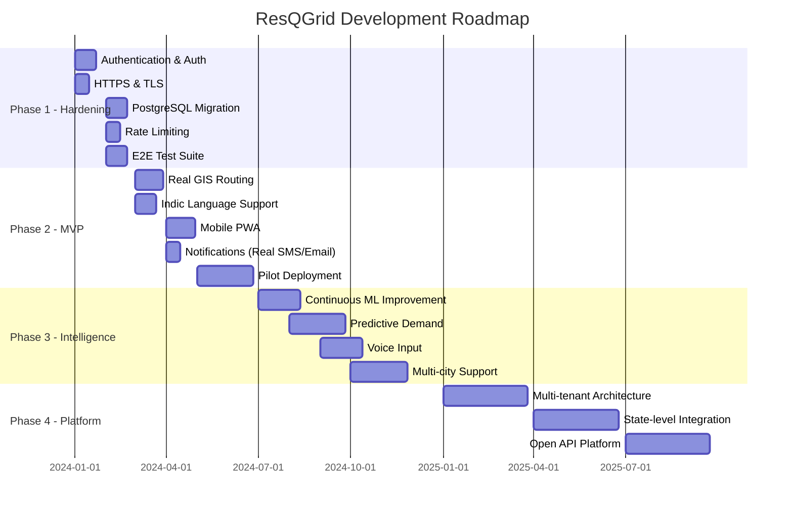

# ResQGrid — Product Roadmap

> **Post-Hackathon Development Vision**
> Phases: Prototype → MVP → Scale → Platform

---

## Table of Contents

1. [Roadmap Overview](#1-roadmap-overview)
2. [Phase 1 — Hardening (Month 1-2)](#2-phase-1--hardening-month-1-2)
3. [Phase 2 — MVP Production (Month 3-6)](#3-phase-2--mvp-production-month-3-6)
4. [Phase 3 — Intelligence Expansion (Month 6-12)](#4-phase-3--intelligence-expansion-month-6-12)
5. [Phase 4 — Platform Scale (Year 2)](#5-phase-4--platform-scale-year-2)
6. [Technical Debt Register](#6-technical-debt-register)
7. [Feature Backlog](#7-feature-backlog)
8. [AI Roadmap](#8-ai-roadmap)

---

## 1. Roadmap Overview

---

## 2. Phase 1 — Hardening (Month 1-2)

**Goal**: Transform the hackathon prototype into a deployable, secure application.

### P1.1 Authentication & Authorization
- Implement JWT-based authentication
- Role definitions: `dispatcher`, `supervisor`, `field_team`, `hospital`, `citizen`, `admin`
- Route-level RBAC: field teams can only update their own assignments; citizens can only submit reports
- Session management with refresh tokens

### P1.2 HTTPS & Security Headers
- TLS certificate provisioning (Let's Encrypt)
- HTTP → HTTPS redirect
- Secure WebSocket (wss://)
- Security headers: HSTS, CSP, X-Frame-Options

### P1.3 Database Migration (SQLite → PostgreSQL)
- Schema migration scripts
- Connection pooling with PgBouncer
- Encrypted connection (SSL mode)
- Alembic for schema migrations going forward

### P1.4 Rate Limiting
- Ingest endpoints: 60 requests/minute per IP
- AI endpoints: 20 requests/minute per authenticated user
- WebSocket: 1 connection per authenticated client

### P1.5 End-to-End Test Suite
- API endpoint integration tests with `pytest` + `httpx.AsyncClient`
- WebSocket event delivery tests
- Frontend Playwright E2E tests for critical user flows
- CI/CD pipeline (GitHub Actions)

---

## 3. Phase 2 — MVP Production (Month 3-6)

**Goal**: Deploy to a real municipality (Vadodara pilot).

### P2.1 Real GIS Routing
- Integrate OSRM (Open Source Routing Machine) for actual road-network ETAs
- Replace Haversine straight-line ETAs with turn-by-turn travel time estimates
- Unit speed profiles by time-of-day and day-of-week
- Traffic integration (Google Maps Platform or OSRM with HERE traffic)

### P2.2 Indic Language Support
- Hindi NLP pipeline for citizen report classification
- Gujarati language support
- Support for mixed script inputs (Devanagari + Latin)
- LLM multilingual prompting strategy

### P2.3 Mobile PWA
- Progressive Web App with offline capability
- Push notifications for field teams (Web Push API)
- GPS tracking via Geolocation API (opt-in)
- App installation on Android home screen

### P2.4 Real Telephony Integration
- IVRS (Interactive Voice Response) integration with DIAL 112
- Call transcript processing via speech-to-text (Google Cloud STT or Whisper)
- Call recording and playback in incident drawer

### P2.5 Pilot Deployment (Vadodara Municipal Corporation)
- Deploy to cloud VM (GCP/AWS/NFRA)
- Integrate with VMC's existing emergency call center (DIAL 112 feed)
- Training for EOC operators (2-day workshop)
- 30-day supervised pilot

---

## 4. Phase 3 — Intelligence Expansion (Month 6-12)

**Goal**: Make the AI genuinely useful and continuously improving.

### P3.1 Continuous ML Improvement
- Dispatcher correction feedback loop (overridden classification → training example)
- Active learning: flag low-confidence predictions for manual review
- Weekly model retraining pipeline
- A/B testing of classification models

### P3.2 Predictive Resource Demand
- Historical incident pattern analysis by type/area/time-of-day/season
- Pre-positioning alerts: "Based on Friday evening traffic patterns, recommend pre-positioning 2 ambulances on NH48"
- Flood forecast integration with IMD API for pre-alert positioning

### P3.3 Voice Input
- Browser Web Speech API for citizen reports (English + Hindi)
- Real-time transcription display
- Voice-controlled field team status updates

### P3.4 Shift Handover Automation
- Auto-generated shift handover document at EOD
- Summary: incidents handled, response times, notable events, open items
- Sent to incoming shift commander via email

### P3.5 Multi-City Support
- City-configurable gazetteer and seed data
- Per-city alert rule customization
- Multi-city analytics dashboard for state-level view

---

## 5. Phase 4 — Platform Scale (Year 2)

**Goal**: Become the state/national emergency response platform.

### P4.1 Multi-Tenant Architecture
- SaaS deployment for multiple municipalities
- Tenant isolation at the database level
- Per-tenant resource pools

### P4.2 State-Level Integration
- SDMA (State Disaster Management Authority) dashboard
- Cross-district resource sharing and mutual aid coordination
- NDRF integration for major disaster declaration

### P4.3 Open API Platform
- Public API for NGOs, hospitals, NDRF units
- Webhook subscriptions for third-party systems
- Developer portal with API documentation

### P4.4 Advanced Analytics Platform
- Machine learning-based predictive risk scoring
- Post-incident analysis tools
- Performance benchmarking against national standards

---

## 6. Technical Debt Register

Items that were deliberately left as technical debt due to hackathon time constraints:

| # | Debt Item | Impact | Priority |
|---|---|---|---|
| TD-01 | SQLite → PostgreSQL migration | Scalability; concurrent writes | P0 |
| TD-02 | No authentication | Security | P0 |
| TD-03 | Hardcoded notification recipients | Operational flexibility | P1 |
| TD-04 | In-memory LRU cache (not shared, lost on restart) | Performance at scale | P2 |
| TD-05 | Haversine ETAs (not real road routing) | Recommendation accuracy | P2 |
| TD-06 | Single-process EventBus (no horizontal scale) | Scale | P2 |
| TD-07 | Mock mode not formally tested | Demo reliability | P2 |
| TD-08 | No database index on Incident.area, type, priority | Query performance | P2 |
| TD-09 | Training data not versioned | ML reproducibility | P3 |
| TD-10 | No cleanup of old notification records | Storage growth | P3 |

---

## 7. Feature Backlog

Community-requested and team-identified features not in the current build:

| Feature | Category | Estimated Effort | Priority |
|---|---|---|---|
| Incident timeline visualization | UX | Medium | High |
| Resource scheduling (next-shift planning) | Operations | Large | High |
| Map clustering for dense incident areas | Map | Small | Medium |
| Incident similarity search | AI | Medium | Medium |
| Export incident report to PDF | Reporting | Small | Medium |
| Hospital diversion aggregation view | Hospital | Small | Medium |
| Multi-language UI (Hindi/Gujarati) | i18n | Large | High |
| Dark/light mode toggle | UX | Small | Low |
| Accessibility (WCAG 2.1 AA) | Accessibility | Large | High |
| Keyboard navigation for console | Accessibility | Medium | Medium |
| Incident merge suggestion (UI improvement) | UX | Small | Medium |
| Field team fatigue tracking | Operations | Medium | Medium |
| Equipment stock management | Inventory | Large | Low |
| Custom SLA thresholds per agency | Configuration | Medium | Low |

---

## 8. AI Roadmap

Specific AI/ML enhancements planned:

### Near-term (Phase 2)

**Embedding-Based Deduplication:**
Replace TF-IDF cosine similarity with sentence embeddings (multilingual-e5-large or similar) for better cross-lingual deduplication and paraphrase detection.

**Confidence Calibration:**
The current ML classifier returns uncalibrated confidence scores. Apply Platt scaling or isotonic regression to make confidence values more meaningful and comparable across models.

### Medium-term (Phase 3)

**Shift Handover Report Generation:**
LLM-generated comprehensive shift handover document drawing from incident logs, audit events, and outstanding items.

**Predictive Demand Model:**
Time-series regression model (Prophet or LSTM) to predict incident volume and type by hour/day/ward, enabling pre-positioning recommendations.

### Long-term (Phase 4)

**Multi-modal Incident Intake:**
Process image and video evidence submitted with citizen reports using vision models to supplement text classification with visual evidence.

**Dynamic Resource Matching:**
Reinforcement learning agent that learns from historical dispatch outcomes (did the recommended unit actually arrive first?) to continuously improve the matching scoring weights.

---

*This roadmap represents aspirational planning based on the hackathon prototype. Prioritization would be driven by pilot user feedback, regulatory requirements, and funding availability.*

*This document is part of the ResQGrid documentation package.*
